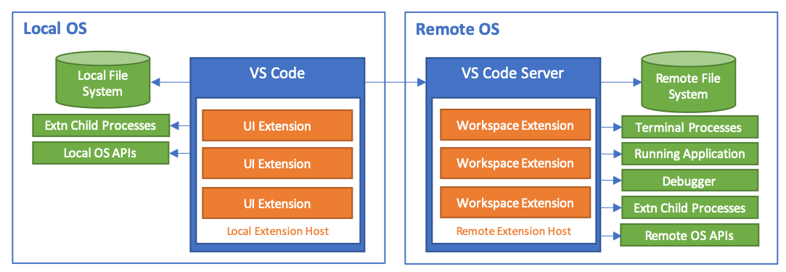

# 番外：Ansible {id="ansible-index"}

---

最权威，没有之一：[Ansible Core - Official Documentation](http://docs.ansible.com/ansible/latest/index.html)

最权威，没有之一：[Ansible Core - Official Documentation](http://docs.ansible.com/ansible/latest/index.html)

最权威，没有之一：[Ansible Core - Official Documentation](http://docs.ansible.com/ansible/latest/index.html)

---

## 提纲

* 安装
* 核心术语
* Hello World
* 术语列表
* 项目结构
* 开发环境配置
* 更多实例

# 版本说明

---

```bash
ansible --version
# ansible 2.9.7
#   config file = None
#   configured module search path = ['/home/cuc/.ansible/plugins/modules', '/usr/share/ansible/plugins/modules']
#   ansible python module location = /home/cuc/.pyenv/versions/3.6.8/lib/python3.6/site-packages/ansible
#   executable location = /home/cuc/.pyenv/versions/3.6.8/bin/ansible
#   python version = 3.6.8 (default, Apr 10 2020, 17:47:18) [GCC 7.5.0]
```

# [安装](http://docs.ansible.com/ansible/latest/intro_installation.html) { id="installation" }

---

Ansible 官方推荐 `Red Hat Enterprise Linux (TM)`, `CentOS`, `Fedora`, `Debian`, `Ubuntu` 操作系统用户直接使用操作系统官方维护和打包的最新版软件包。除此之外，也可以通过 Python 的包管理器 `pip` 进行安装。

---

## apt-get install 方式安装注意事项 {id="apt-get-issue-1"}

```bash
# Ubuntu 18.04 默认镜像源里提供的 ansible 版本较旧
apt policy ansible
# ansible:
#   Installed: (none)
#   Candidate: 2.5.1+dfsg-1ubuntu0.1
#   Version table:
#      2.5.1+dfsg-1ubuntu0.1 500
#         500 http://archive.ubuntu.com/ubuntu bionic-updates/universe amd64 Packages
#         500 http://archive.ubuntu.com/ubuntu bionic-updates/universe i386 Packages
#         500 http://security.ubuntu.com/ubuntu bionic-security/universe amd64 Packages
#         500 http://security.ubuntu.com/ubuntu bionic-security/universe i386 Packages
#      2.5.1+dfsg-1 500
#         500 http://archive.ubuntu.com/ubuntu bionic/universe amd64 Packages
#         500 http://archive.ubuntu.com/ubuntu bionic/universe i386 Packages
```

---

## apt-get install 方式安装注意事项 {id="apt-get-issue-2"}

```bash
sudo apt update
sudo apt install software-properties-common
sudo apt-add-repository --yes --update ppa:ansible/ansible
apt policy ansible
# ansible:
#   Installed: (none)
#   Candidate: 2.9.9-1ppa~bionic
#   Version table:
#      2.9.9-1ppa~bionic 500
#         500 http://ppa.launchpad.net/ansible/ansible/ubuntu bionic/main amd64 Packages
#         500 http://ppa.launchpad.net/ansible/ansible/ubuntu bionic/main i386 Packages
#      2.5.1+dfsg-1ubuntu0.1 500
#         500 http://archive.ubuntu.com/ubuntu bionic-updates/universe amd64 Packages
#         500 http://archive.ubuntu.com/ubuntu bionic-updates/universe i386 Packages
#         500 http://security.ubuntu.com/ubuntu bionic-security/universe amd64 Packages
#         500 http://security.ubuntu.com/ubuntu bionic-security/universe i386 Packages
#      2.5.1+dfsg-1 500
#         500 http://archive.ubuntu.com/ubuntu bionic/universe amd64 Packages
#         500 http://archive.ubuntu.com/ubuntu bionic/universe i386 Packages
sudo apt install ansible
```

---

## pip 方式安装的 ansible

```bash
# 当前系统中已通过 pip 安装的 ansible 版本信息
pip freeze | grep ansible
# ansible==2.9.7

# 搜索最新版 ansible 候选安装包信息
pip search ansible
# ansible (2.9.9)                              - Radically simple IT automation
#   INSTALLED: 2.9.7
#   LATEST:    2.9.9

# 升级 pip 方式安装的 ansible
pip install -U ansible

# 国内安装时临时使用清华 pypi 镜像源
pip install -i https://pypi.tuna.tsinghua.edu.cn/simple -U ansible
```

# 核心术语 {id="required-terms"}

---

[Ansible 官方安装指南](https://docs.ansible.com/ansible/latest/installation_guide/intro_installation.html#prerequisites) 中的「先决条件」。

> You install Ansible on a **control node**, which then uses **SSH (by default)** to communicate with your **managed nodes** (those end devices you want to automate).

* **控制节点**。安装 `ansible` 软件的系统。
* **被管理节点**。无需安装 `ansible` 软件，接受 `ansible` 自动化管理的系统，但需要安装 `python` 解释器。

---

## Python3 解释器的安装方式 {id="python3-install"}

```bash
apt policy python3
# python3:
#   Installed: 3.6.7-1~18.04
#   Candidate: 3.6.7-1~18.04
#   Version table:
#  *** 3.6.7-1~18.04 500
#         500 http://archive.ubuntu.com/ubuntu bionic-updates/main amd64 Packages
#         100 /var/lib/dpkg/status
#      3.6.5-3 500
#         500 http://archive.ubuntu.com/ubuntu bionic/main amd64 Packages
apt policy python3.6
# python3.6:
#   Installed: 3.6.9-1~18.04
#   Candidate: 3.6.9-1~18.04ubuntu1
#   Version table:
#      3.6.9-1~18.04ubuntu1 500
#         500 http://archive.ubuntu.com/ubuntu bionic-updates/main amd64 Packages
#         500 http://security.ubuntu.com/ubuntu bionic-security/main amd64 Packages
#  *** 3.6.9-1~18.04 100
#         100 /var/lib/dpkg/status
#      3.6.5-3 500
#         500 http://archive.ubuntu.com/ubuntu bionic/main amd64 Packages
apt policy python3.8
# python3.8:
#   Installed: (none)
#   Candidate: 3.8.0-3~18.04
#   Version table:
#      3.8.0-3~18.04 500
#         500 http://archive.ubuntu.com/ubuntu bionic-updates/universe amd64 Packages
```

---

## Ansible 对 Python 版本的要求 {id="python-prerequesites"}

* [Ansible 2.5+ 支持的 Python3 最低版本是 3.5](https://docs.ansible.com/ansible/latest/reference_appendices/python_3_support.html)
    * Ansible 2.5- 对 Python3 的支持是「试验性质」
* **被管理节点** 上同时支持 Python 2.6+ 和 Python 3.5+ 的解释器

---

## 选择哪个 Python 版本 {id="python-versions"}

| 版本号 | PEP                                              | 发布日期   | 完整支持终止   | 安全补丁支持终止 |
| --     | ---                                              | --         | --             | --               |
| 2.7    | [373](https://www.python.org/dev/peps/pep-0373/) | 2010-07-03 | 2020-01-01     | 2020-01-01       |
| 3.5    | [478](https://www.python.org/dev/peps/pep-0478/) | 2015-09-13 | 2017-08-08     | **2020-09-13**   |
| 3.6    | [494](https://www.python.org/dev/peps/pep-0494/) | 2016-12-23 | 2018-12-24     | **2021-12**      |
| 3.7    | [537](https://www.python.org/dev/peps/pep-0537/) | 2018-06-27 | **2020-06-27** | **2023-06**      |
| 3.8    | [569](https://www.python.org/dev/peps/pep-0569/) | 2019-10-14 | **2021-04**    | **2024-10**      |

# Hello World

---

* [将「控制节点」设置为「被管理节点」的信任主机](https://github.com/c4pr1c3/AnsibleTutorial/tree/master/ssh-copy-id)

# 术语列表 {id="terms-list"}

---

* [Inventory](http://docs.ansible.com/ansible/latest/intro_inventory.html)
* [Ad-Hoc Commands](http://docs.ansible.com/ansible/latest/intro_adhoc.html)
* [Playbooks](http://docs.ansible.com/ansible/latest/playbooks.html)
* [Modules](http://docs.ansible.com/ansible/latest/modules.html)
* [Ansible Vault](http://docs.ansible.com/ansible/latest/vault.html)

---

## [Inventory](http://docs.ansible.com/ansible/latest/intro_inventory.html)

* 默认全局 `清单` 文件：`/etc/ansible/hosts`
* **最常用**的 `清单` 文件：`-i <path>` ，通过命令行参数自行指定 `清单` 文件路径

---

## [Ad-Hoc Commands](http://docs.ansible.com/ansible/latest/intro_adhoc.html)

```bash
# 使用 ansible 内置的 ping 模块
## 在 清单 文件中名为 ubuntu 的主机或主机组定义的所有主机上执行
ansible ubuntu -i hosts -m ping
## 在 清单 文件中定义的所有 不重复主机 上执行
ansible all -i hosts -m ping

# 执行远程主机上的指令
ansible all -i hosts -a 'ip addr'
```

---

## [Playbooks](http://docs.ansible.com/ansible/latest/playbooks.html)

> Playbooks 是 Ansible 的 配置、部署和编排语言，可以用于定义远程主机强制执行策略或一般性 IT 过程。

* [Ansible 官方提供的一些示例 Playbooks](https://github.com/ansible/ansible-examples)
* 核心语言使用的 [YAML](http://docs.ansible.com/ansible/latest/YAMLSyntax.html)
* [Ansible 官方提供的指令速查词典](http://docs.ansible.com/ansible/latest/playbooks_keywords.html)

---

### [在 Playbook 里使用变量](https://docs.ansible.com/ansible/latest/user_guide/playbooks_variables.html) {id="playbooks_variables"}

```jinja
{# 简单变量 #}
{{ max_amp_value }}

{# YAML 代码中引用 jinja2 模版变量必须使用双引号 #}
"{{ base_path }}/22"

{# ansible hostname -m setup #}
{{ ansible_facts['devices']['sda']['model'] }}
```

更多关于模版（Jinja2）的帮助请阅读[ Ansible 官方文档](https://docs.ansible.com/ansible/latest/user_guide/playbooks_templating.html) 。

---

变量作用域优先级如下，自顶向下优先级依次升高：

```bash
role defaults 
inventory file or script group vars
inventory group_vars/all
playbook group_vars/all
inventory group_vars/*
playbook group_vars/*
inventory file or script host vars
inventory host_vars/*
playbook host_vars/*
host facts
play vars
play vars_prompt
play vars_files
role vars (defined in role/vars/main.yml)
block vars (only for tasks in block)
task vars (only for the task)
role (and include_role) params
include params
include_vars
set_facts / registered vars
extra vars (always win precedence)
```

---

## [Modules](http://docs.ansible.com/ansible/latest/modules.html)

常见运维任务都可以找到 `ansible` 内置模块的支持

---

* [文件上传、权限设置、查找、元信息获取、基于模版生成配置文件等](http://docs.ansible.com/ansible/latest/list_of_files_modules.html)
* [bower、composer、pip、pear等主流编程语言的包管理工具，apt、homebrew、yum等操作系统包管理工具](http://docs.ansible.com/ansible/latest/list_of_packaging_modules.html)
* [操作系统级别管理工具：用户/用户组管理、systemd服务管理、时区管理、内核加载模块管理等](http://docs.ansible.com/ansible/latest/list_of_system_modules.html)

---

* [远程命令执行、脚本执行等](http://docs.ansible.com/ansible/latest/list_of_commands_modules.html)
* [PKI 证书管理](http://docs.ansible.com/ansible/latest/list_of_crypto_modules.html)
* [常见数据库管理](http://docs.ansible.com/ansible/latest/list_of_database_modules.html)
* [常见Web基础设施管理：supervisorctl、htpasswd、apache2_module、letsencrypt等](http://docs.ansible.com/ansible/latest/list_of_web_infrastructure_modules.html)
* [常见版本控制工具管理](http://docs.ansible.com/ansible/latest/list_of_source_control_modules.html)

---

## [Ansible Vault](http://docs.ansible.com/ansible/latest/vault.html)

[使用 Vault 加密敏感数据](http://docs.ansible.com/ansible/latest/vault.html#what-can-be-encrypted-with-vault) ，可以对以下路径下的文件加密：

* `group_vars/`
* `host_vars/`

也可以对 Ansible 变量加密。

---

* **建议-1** 仅对需要加密的变量进行加密，避免加密扩大化；
* **建议-2** 为了便于 `grep` 等文本检索工具检索所有被引用的变量定义，对于需要加密的变量建议使用一个 **中间变量** 来隔离 `被引用变量` 和 `加密数据`。

---

### 变量加密推荐做法实例 {id="var-encrypted-examples"}

```yaml
# group_vars/demo/vars.yml
demo_group_name: "demo"
demo_users: 
  alice:
    group: "vault_group"
    passwd: "{{ vault_demo_users.alice.passwd }}"
  bob:
    group: "vault_group"
    passwd: "{{ vault_demo_users.bob.passwd }}"

# group_vars/demo/vault.yml
# 该文件的实际内容使用 ansible-vault 加密存储
vault_demo_users:
  alice:
    passwd: "plz-change-me"
  bob:
    passwd: "plz-change-me"
```

# 项目结构

---

[Ansible 最佳实践](http://docs.ansible.com/ansible/latest/playbooks_best_practices.html)

在官方推荐的 [目录布局](http://docs.ansible.com/ansible/latest/playbooks_best_practices.html#directory-layout) 基础之上，进一步精简一个常用目录组织结构：

```yaml
production                # 生产环境服务器清单文件
staging                   # 模拟环境服务器清单文件

group_vars/
   group1                 # here we assign variables to particular groups
   group2                 # ""
host_vars/
   hostname1              # if systems need specific variables, put them here
   hostname2              # ""

site.yml                  # master playbook
webservers.yml            # playbook for webserver tier
dbservers.yml             # playbook for dbserver tier

roles/
    common/               # this hierarchy represents a "role"
        tasks/            #
            main.yml      #  <-- tasks file can include smaller files if warranted
        handlers/         #
            main.yml      #  <-- handlers file
        templates/        #  <-- files for use with the template resource
            ntp.conf.j2   #  <------- templates end in .j2
        files/            #
            bar.txt       #  <-- files for use with the copy resource
            foo.sh        #  <-- script files for use with the script resource
        vars/             #
            main.yml      #  <-- variables associated with this role
        defaults/         #
            main.yml      #  <-- default lower priority variables for this role
        meta/             #
            main.yml      #  <-- role dependencies

    webtier/              # same kind of structure as "common" was above, done for the webtier role
    monitoring/           # ""
    fooapp/               # ""
```

# 开发环境配置

---

## 常见的「开发环境配置需求」

* 自动补全
    * 重复输入内容
    * 语法关键字
    * 常用代码片段
* 语法高亮
* 语法检查
* 调试
* 运行
* 语法即时帮助

---

## 编辑器

* vscode
    * [Ansible](https://marketplace.visualstudio.com/items?itemName=vscoss.vscode-ansible)
    * [Better Jinja](https://marketplace.visualstudio.com/items?itemName=samuelcolvin.jinjahtml)
    * [Remote - SSH](https://marketplace.visualstudio.com/items?itemName=ms-vscode-remote.remote-ssh)
    * [Remote - SSH: Editing Configuration Files](https://marketplace.visualstudio.com/items?itemName=ms-vscode-remote.remote-ssh-edit)
    * [（可选）vim](https://marketplace.visualstudio.com/items?itemName=vscodevim.vim)

---

### [Ansible](https://marketplace.visualstudio.com/items?itemName=vscoss.vscode-ansible)

[vscode 里全局 settings.json 里设置 files.associations](https://code.visualstudio.com/docs/languages/identifiers)

```json
"files.associations": {
    "**/defaults/**/*": "ansible",
    "**/tasks/**/*.yml" : "ansible",
    "**/handler/*.yml" : "ansible",
    "**/*_vars/**/*.yml" : "ansible",
    "**/roles/**/*.yml" : "ansible",
    "**/playbooks/**/*.yml" : "ansible",
    "**/*ansible*/**/*.yml" : "ansible",
    "**/vars/**/*.yml": "ansible",
    "**/inventory/*/*": "ansible"
}
```

[以上参考 language-Ansible 的文件关联配置](https://marketplace.visualstudio.com/items?itemName=haaaad.ansible)

---

### [使用 SSH 进行远程开发](https://code.visualstudio.com/docs/remote/ssh)



---

## 语法检查

* ansible-lint
* yamllint

---

### 安装

```bash
pip install ansible-lint yamllint
```

---

### 小结

* 自动补全
    * 重复输入内容: [vscode 内置功能](https://stackoverflow.com/questions/51341555/visualcode-shortcut-to-display-autocomplete-list-before-typing-in-macos)
    * 语法关键字: [Ansible 扩展](https://marketplace.visualstudio.com/items?itemName=vscoss.vscode-ansible)
    * 常用代码片段: [Ansible 扩展 snippets 功能](https://marketplace.visualstudio.com/items?itemName=vscoss.vscode-ansible)
* 语法高亮 [Ansible 扩展](https://marketplace.visualstudio.com/items?itemName=vscoss.vscode-ansible) + [Better Jinja](https://marketplace.visualstudio.com/items?itemName=samuelcolvin.jinjahtml)
* 语法检查 `ansible-lint` + `yamllint`
* 调试 [Ansible 内置的 debug 模块，调试打印方式](https://docs.ansible.com/ansible/latest/modules/debug_module.html)
* 运行 [Remote - SSH](https://marketplace.visualstudio.com/items?itemName=ms-vscode-remote.remote-ssh)
* 语法即时帮助 暂时没有集成解决方案

# Playbooks 实例 {id="more-playbooks"}

---

* [原创实例](https://github.com/c4pr1c3/AnsibleTutorial)
* [Ansible 官方提供的一些示例 Playbooks](https://github.com/ansible/ansible-examples)
* [Working with Ansible Playbooks – Tips & Tricks with Examples](https://spacelift.io/blog/ansible-playbooks)

# 参考资料

---

* [Cheatsheet of Ansible](http://cheat.readthedocs.io/en/latest/ansible/)
* [An Ansible summary Jon Warbrick, July 2014, V3.2 (for Ansible 1.7)](https://gist.github.com/andreicristianpetcu/b892338de279af9dac067891579cad7d)

# 附录 A

---

## YAML 快速上手 {id="yaml-quickstart"}

* （可选）`---` 定义 YAML 文件开始，`...` 定义 YAML 文件结束
* `list` 数据结构，使用 `- ` （一个短杠和一个空格）
* `dict` 数据结构，使用 `key: value` 形式
* 续行符
    * `|` 包含换行符
    * `>` 忽略换行符
* 尽可能多的使用 **双引号** 包围变量的赋值

---

## YAML 简单例子 {id="yaml-basic-examples"}

```yaml
# Employee records
- martin:
    name: Martin D'vloper
    job: Developer
    skills:
      - python
      - perl
      - pascal
- tabitha:
    name: Tabitha Bitumen
    job: Developer
    skills:
      - lisp
      - fortran
      - erlang

# 上述例子的等价单行写法如下：
# 可以将以下内容复制粘贴到 http://www.yamllint.com/ 进行验证
- martin: {name: Martin D'vloper, job: Developer, skill: [python, perl, pascal]}
- tabitha: {name: Tabitha Bitumen, job: Developer, skill: [lisp, fortran, erlang]}
```

---

## YAML 多行字符串例子 {id="yaml-multiple-lines"}

```yaml
include_newlines: |
            exactly as you see
            will appear these three
            lines of poetry

ignore_newlines: >
            this is really a
            single line of text
            despite appearances
```


