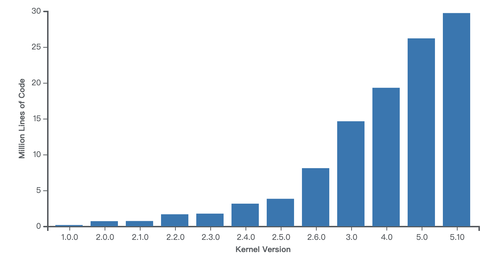
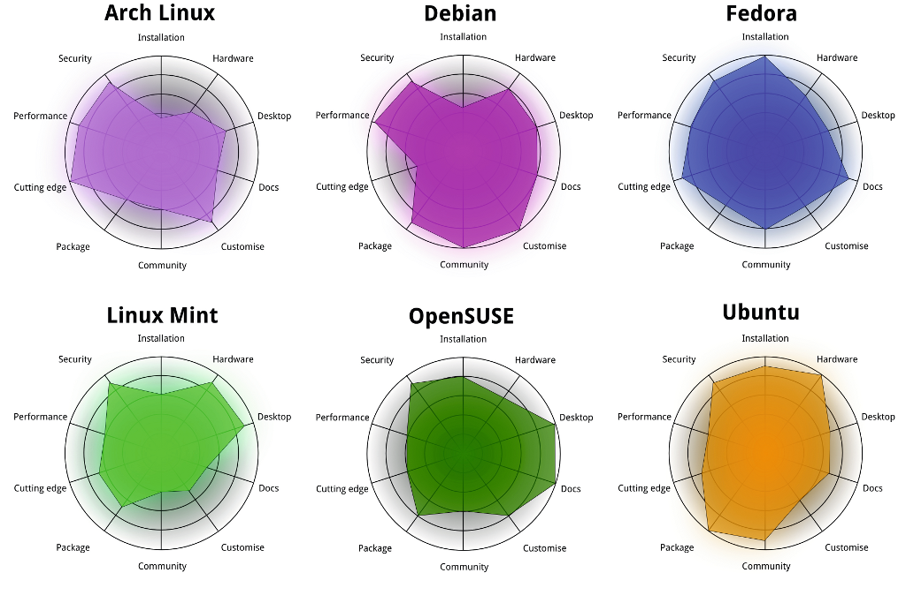
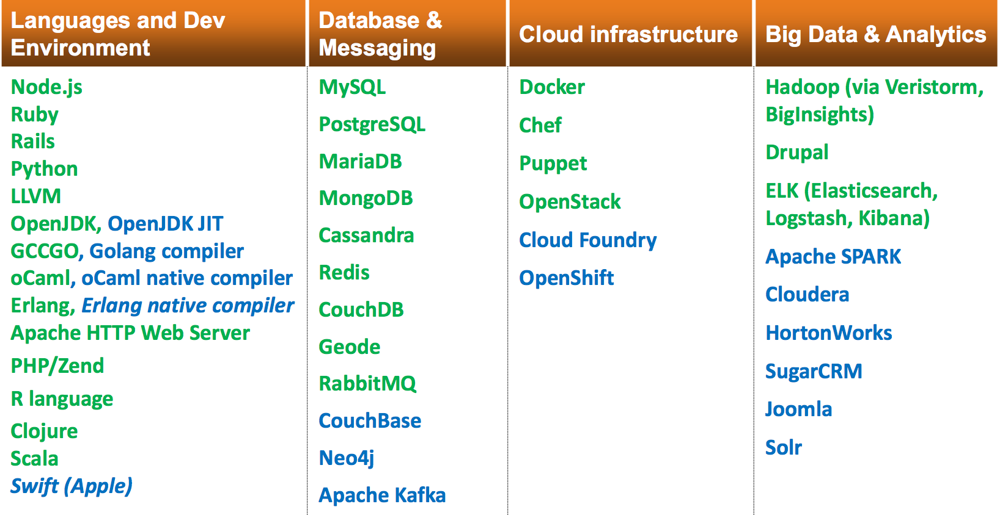
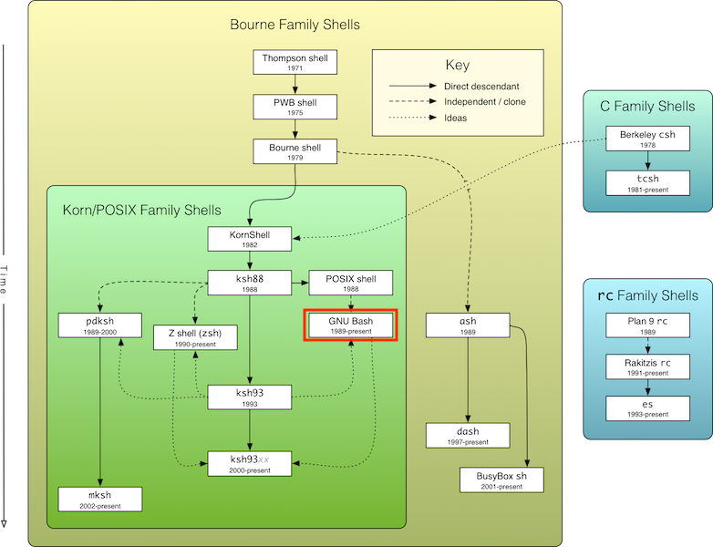

# 第一章：Linux基础

---

## GNU is NOT Unix

# Linux考据历史

---

## 缘起

* Unix操作系统于1970年首次发布，作者是AT&T贝尔实验室大名鼎鼎的C语言之父：Ken Thompson（在Google与他人联合设计了Go语言）和Dennis Ritchie
* 1977年，UC Berkeley的Computer Systems Research Group (CSRG)基于Unix第6版开发了Berkeley Software Distribution (BSD)操作系统
    * AT&T在90年代起诉UC Berkeley在BSD系统中使用了Unix的商业版权源代码

---

* 1983年，Richard Stallman创建了类Unix，与POSIX兼容的操作系统为目标的GNU计划
    * 项目工作之余编写了GNU General Public License (GPL)
    * 同年，Unix和C语言之父K&D因“研究发展了通用的操作系统理论，尤其是实现了UNIX操作系统”获得“计算机界的诺贝尔奖”——图灵奖
* 1987年，一个16位兼容POISX标准的类UNIX系统——MINIX系统发布，源代码公开但禁止修改和重新发布

---

## 起源

* 1991年，来自芬兰21岁的Linus Torvalds在comp.os.minix新闻组的Usenet首次发布了Linux 0.01版，该系统是在Minix上使用gcc编译器开发编译的面向32位PC硬件架构的操作系统
* 由于从0.01版开始，Linux就使用到了一些GNU软件，于是在1992年12月发布的0.99版就使用了GNU GPL

---

## 命名

* 最开始Linux仅被Torvalds用于指代Linux内核，但该内核总是配合大量GNU软件一起使用
* GNU官方的公告板在1994年Linux被称为“自由UNIX克隆版”
* 另一个著名的开源软件项目Debian把它发布的操作系统命名为：Debian GNU/Linux
* 1996年，Richard Stallman在其发布的Emacs 19.31版中称呼Linux为Lignux，不过很快这个名称最终被定为：GNU/Linux

--- 

## [Linux内核](https://www.kernel.org/)

<a href="https://en.wikipedia.org/wiki/Linux_kernel"></a>

# Linux生态圈

---


---

| 英文 |   中文 |
|------------+--------------------------|
| Linux Development Community | Linux开发社区 |
| Linux Distribution | Linux发行版 |
| Carrier | 电信运营商 |
| Network Equipment Provider | 网络设备提供商 |
| OSS(Open-source Software) Community | 开源软件社区 |
| ISV(Independent Software Vendor) | 独立软件开发商 |
| Hardware Manufacturer | 硬件制造商 |

---

## Linux生态圈 - 开发社区与Git

* 早期的Linux内核开使用发商业化的版本控制软件BitKeeper进行代码管理，但开源社区对这个选择充满了质疑
* Torvalds本人最初是希望避免重复造轮子，但他本人又对现有的版本控制系统均不满意，于是在2005年花了10天时间开发完成了第一个git版本
* 不同于CVS、SVN等集中式版本控制工具，git采用分布式版本管理，不需要服务器端软件


---

## Git与GitHub

* Git是一款免费、开源的分布式版本控制系统
* GitHub是用Git做版本控制为全球开源软件作者提供免费、集中的代码托管平台
    * 针对私有闭源软件项目提供收费的代码托管服务
    * 目前主流的开源项目普遍将代码托管在GitHub上，软件开发过程可以被全世界所有人透明的查看和监管

---

## GitHub

* [GitHub在知乎上的主题索引](https://www.zhihu.com/topic/19566035)
* Google: github awesome xxxx
    * github awesome android
    * github awesome security
    * github awesome javascript

---

## Linux生态圈 - [发行版](https://en.wikipedia.org/wiki/Comparison_of_Linux_distributions)

* Linux内核
    * [Debian](https://www.debian.org/): 非营利性组织运营的开源软件构建发布版本
        * [Ubuntu](http://www.ubuntu-china.cn/about/)：商业公司Canonical基于Debian构建和维护
            * [Linux Mint](https://www.linuxmint.com/about.php)：开源社区维护
    * Fedora
        * RHEL: Red Hat Enterprise Linux
            * CentOS
            * Oracle Linux
    * [SUSE](https://www.suse.com/)
        * SLES: SUSE Linux Enterprise Server
        * [openSUSE](https://zh.opensuse.org/)
    * 其他发行版

---

## Linux生态圈 - 发行版

<a href="http://tuxradar.com/content/best-distro-2011"></a>

---

## Linux生态圈 - LSB

* [Linux Standard Base, LSB](https://wiki.linuxfoundation.org/lsb/start)
* 愿景和使命
    * 当Linux成为一个平台之后，应用软件开发者希望实现**write once** (on one Linux distribution will) **run everywhere** (on other Linux distributions) 
    * 不仅如此，应用软件开发者希望平台的升级更新不要影响到他们已完成代码的可用性和兼容性

---

## Linux生态圈 - CGL

* [Carrier Grade Linux, CGL](https://wiki.linuxfoundation.org/cgl/start) ：电信运营商级Linux
* 愿景和使命
    * 调研网络设备提供商和电信运营商的需求并为Linux发行版厂商制定实现规范
    * 帮助上游厂商在技术上整合实现以满足上述需求标准

---

## Linux生态圈 - [CGL](https://www.linuxfoundation.org/sites/lfcorp/files/CGL_5.0_Specification.pdf)

需求类别

* 可用性
* 集群
* 可服务
* 性能
* 标准化
* 硬件
* 安全

# OSS(Open-source Software) Community 开源软件社区

---

* [The largest open source community in the world on GitHub](https://github.com/open-source)
* [Open Source Licenses](https://opensource.org/licenses)

<a href="http://events.linuxfoundation.org/sites/events/files/slides/lcna15_linuxone.pdf"></a>

---

ISV(Independent Software Vendor) 独立软件开发商

<a href="http://events.linuxfoundation.org/sites/events/files/slides/lcna15_linuxone.pdf"></a>

---

Hardware Manufacturer  硬件制造商 

* [Hardware on LinuxMint](https://community.linuxmint.com/hardware)
* [Ubuntu 认证硬件](https://certification.ubuntu.com/)
* [Hardware on Debian](https://wiki.debian.org/Hardware)
* [Hardware on RedHat](https://hardware.redhat.com)

# 开源与商业化

---

* Linux基金会
* OpenStack基金会
* Apache
* Canoical

---

## Linux基金会 {id="linux-foundation"}

* 孵化了[大量知名开源项目](https://www.linuxfoundation.org/projects)
    * 例如：KVM、Xen、nodejs、Open vSwitch等
* Linux基金会采用的是[会员制，分为：银级、金级、白金级三个等级，白金级是最高等级](https://www.linuxfoundation.org/about/bylaws)。
    * [白金会员（年费50万美元）：思科、富士通、惠普企业、华为、IBM、英特尔、NEC、甲骨文、高通、三星和微软](https://www.linuxfoundation.org/members/corporate)
    * 黄金会员（年费10万美元）
    * 银级会员，按员工数量规模浮动5千美元/年 ～ 2万美元/年

---

## [OpenStack基金会](https://www.openstack.org/foundation/)

* OpenStack由NASA（美国国家航空航天局）和Rackspace合作研发并发起，旨在为公共及私有云的建设与管理提供软件的开源项目
* 目前（截止2017年2月）共有来自全球180个国家超过6万名独立会员
* [白金会员](https://www.openstack.org/join/)：50万美元/年起步，2名全职工程师贡献
* 黄金会员：5万 ～20万美元/年，按照企业净收入的0.025%为参考
* 企业赞助：创业公司1万美元/年起，其他公司2.5万美元/年起
* 其他主要收入方式：认证、培训、商业化服务支持（安装、部署、架构、集成、定制开发等）

---

## Apache

* Apache软件基金会，简称为ASF，它支持的Apache项目与子项目中，所发行的软件产品都需要遵循Apache许可证（Apache License）。
* 目前其已经监管了[数百个开源项目](https://www.apache.org/index.html#projects-list)，其中的知名项目包括：Apache HTTP Server、Hadoop、Spark、Kafka、Groovy、Struts等。
* [会员赞助制](https://www.apache.org/foundation/sponsorship.html)，这里是[赞助商名单致谢清单](https://www.apache.org/foundation/thanks.html)
    * 白金：10万美元/年
    * 黄金：4万美元/年
    * 白银：2万美元/年
    * 青铜：5千美元/年
* [任性打赏捐赠](https://www.apache.org/foundation/contributing.html)

---

## [Canonical](https://www.canonical.com/)

* [科能软件有限公司（Canonical Ltd.） 是一家私人公司，由南非的企业家马克·沙特尔沃思创建，主要为了促进开源软件项目。](https://en.wikipedia.org/wiki/Canonical_\(company\))
* Canonical在曼岛登记注册，其雇员分布在世界各地，其主要办事处在伦敦，在波士顿、圣保罗、蒙特利尔、上海、台北和马恩岛也有分公司。
* 主要产品：Ubuntu家族的Linux发行版

本课程主要以Ubuntu系统为基础实验环境。

# Ubuntu

---

不同版本的维护周期规划


# Ubuntu安装 {id="ubuntu-install"}

---

* 物理主机安装
* 虚拟机安装

---

## 安装前准备

* 优先选择当前可用最新的长期支持版本（LTS），下载iso文件
    * 刻盘 / U盘
* 新手避免直接在物理主机上安装Linux，推荐在虚拟机里安装（直接挂载使用iso文件）
* 磁盘容量准备
    * [桌面版](https://www.ubuntu.com/download/desktop/install-ubuntu-desktop): 至少20GB
    * [服务器](https://www.ubuntu.com/download/server/install-ubuntu-server)：至少10GB
    * 虚拟机安装推荐使用**动态分配**的虚拟硬盘，预分配80GB磁盘空间
* 优先选择64位系统

---

## 安装中

* 推荐在安装时软件包选择界面勾选（使用**空格键**确认勾选，使用**方向键**移动菜单光标）安装**OpenSSH server**
* 建议断网安装，避免安装时由于网速慢、联网更新会导致整个安装过程时间较长

---

## 安装后

* 及时备份纯净系统

---

## 安装过程自动化（无人值守）

* [Preseed by Debian](https://wiki.debian.org/DebianInstaller/Preseed)
    * [基于官方iso格式安装镜像制作无人值守定制安装镜像](https://help.ubuntu.com/community/InstallCDCustomization)
    * [Automating the installation using preseeding by Ubuntu](https://help.ubuntu.com/lts/installation-guide/amd64/apb.html)
        * [Ubuntu官方提供的preseed示例文件](https://help.ubuntu.com/lts/installation-guide/example-preseed.txt)
* [Kickstart by RedHat](http://pykickstart.readthedocs.io/en/latest/kickstart-docs.html)
    * [Cobbler](http://cobbler.github.io/)

# 虚拟机环境配置使用FAQ

---

* server版的ubuntu如何从命令行挂载Virtualbox的虚拟光驱中镜像？
* server版的ubuntu如何安装Virtualbox增强功能套件？
* server版的ubuntu如何从命令行挂载Virtualbox的共享目录？

***自行Google解决上述问题***，OR ***第3章内容学习完成之后来解决***

# 命令行

---

* CLI: **Command** Line Interface
    * 使用键盘输入命令，屏幕文字输出结果
* GUI: Graphics User Interface
    * 使用键鼠（也包括红外、体感等新型交互传感器技术）输入命令，图文音输出结果
* CUI: **Conversational** User Interface
    * 使用语音输入命令，五感反馈
    * AI驱动重新发明CLI

---

## 命令行的特点

图形用户界面让简单的任务更容易完成，而命令行界面使完成复杂的任务成为可能

* 全键盘输入：专业工作效率高
* 面向自动化：管道、文件、脚本

# 内置帮助系统

---

```bash
man man

...
The  table below shows the section numbers of the manual followed by the types of pages they contain.
       1   Executable programs or shell commands
       2   System calls (functions provided by the kernel)
       3   Library calls (functions within program libraries)
       4   Special files (usually found in /dev)
       5   File formats and conventions eg /etc/passwd
       6   Games
       7   Miscellaneous (including macro packages and conventions), e.g. man(7), groff(7)
       8   System administration commands (usually only for root)
       9   Kernel routines [Non standard]
...

```

---

* 使用**h**获取man帮助系统中的内置帮助（快捷键映射定义），学习如何使用man
* 使用**q**退出man帮助系统或子页面
* 使用**上下**键滚动页面，使用**空格**键向下翻页
* 使用**/**键查找关键词（不区分大小写），使用**n**查看下一个匹配结果

---

man的常用命令行参数

```bash
# 安装开发相关的manual
sudo apt-get install manpages-dev

# 在所有section中查找主题为printf的手册页
man -a printf

# 在所有manual的正文中查找printf关键词
man -k printf

# 直接查看系统调用类帮助文档中主题名为printf的手册页
man 3 printf
```

---

## 内置帮助系统 - 惯例

* 大多数命令行程序都支持**-h**或**--help**参数来获取内置的简洁使用帮助

# Shell

---

## [什么是shell](https://www.gnu.org/software/bash/manual/html_node/What-is-a-shell_003f.html)

* shell 就是一个执行命令的「宏」处理器：输入的文本和符号被扩展为更「宏大」的表达式
* Unix shell 即是一个「命令解释器」，也是一种「编程语言」
* shell 的运行模式：交互模式、非交互模式
    * 交互模式：从键盘输入指令解释执行
    * 非交互模式：从文件读取指令解释执行
* shell 同时支持同步或异步执行指令

---

## [shell家族](https://en.wikipedia.org/wiki/Unix_shell)



---

## [命令行快捷键](http://billie66.github.io/TLCL/book/chap09.html)

* 自动补全
    * **TAB**
* 重复输入命令
    * **上下键**
    * **Ctrl-R**

# 文本编辑与查看

---

* echo
* cat
* less
* vim / vimtutor
* sort
* uniq
* wc

---

问：如何生成一个随机的字符串？

---

答：让新手退出Vim。

# SSH与远程服务器管理

---

* 免密登录
    * ssh-copy-id
    * ~/.ssh/authorized_keys
* SSH跳板与堡垒主机
```bash
# ProxyCommand
man ssh_config
```
* [SSH服务器安全加固](http://sec.cuc.edu.cn/huangwei/course/2014_2/nsLecture0x10.pdf)

---

## SSH客户端

* Linux / Mac
    * ssh
* Windows
    * [putty](http://www.putty.org/)
    * [xshell](https://www.netsarang.com/download/down_xsh.html)
    * [MobaXterm](http://mobaxterm.mobatek.net/)

# Virtualbox虚拟机实验环境建议

---

* 使用双网卡：Host-only + NAT

# 参考文献

---

* [History of Linux from WikiPedia](https://en.wikipedia.org/wiki/History_of_Linux)
* [Arch compared to other distributions](https://wiki.archlinux.org/index.php/Arch_compared_to_other_distributions_(%E7%AE%80%E4%BD%93%E4%B8%AD%E6%96%87))
* [GitHub在知乎上的主题索引](https://www.zhihu.com/topic/19566035)
* [Ubuntu Installation Guide（官方文档）](https://help.ubuntu.com/lts/installation-guide/)
* [How to install Ubuntu - The Ubuntu Installation Guide](https://builtvisible.com/the-ubuntu-installation-guide/)
* [How do I create an EFI-bootable ISO of a customized version of Ubuntu?](http://askubuntu.com/questions/457528/how-do-i-create-an-efi-bootable-iso-of-a-customized-version-of-ubuntu)
* [How do I create a completely unattended install of Ubuntu Desktop 16.04.1 LTS?](http://askubuntu.com/questions/806820/how-do-i-create-a-completely-unattended-install-of-ubuntu-desktop-16-04-1-lts)
* [快乐的Linux命令行](http://billie66.github.io/TLCL/index.html) | [The Linux Command Line](http://linuxcommand.org/tlcl.php)


