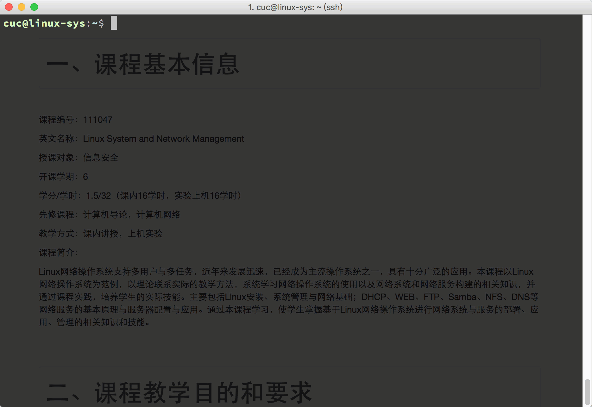
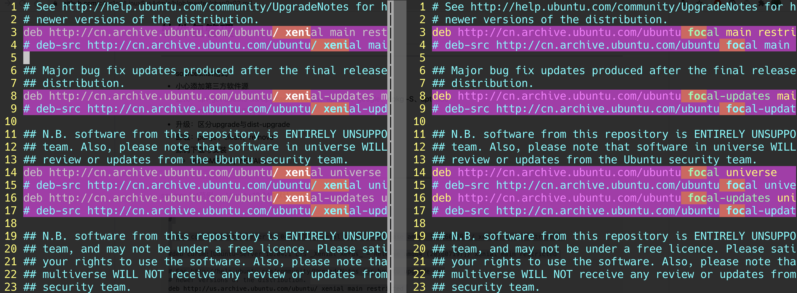
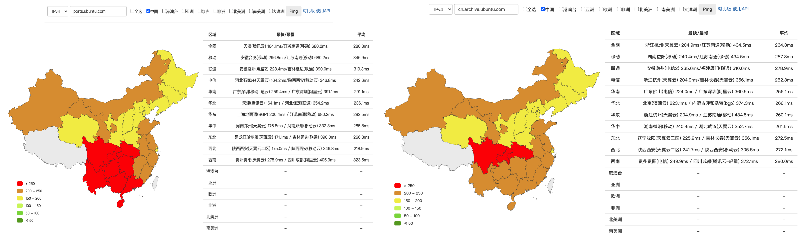

# 第二章：Linux服务器系统使用基础

---

## From GUI to CLI



# 软件包管理

---

## 提纲

* sources.list格式
* 小心添加第三方软件源
* 查找：apt-get update && apt-cache search、apt-file、google、dpkg -S、aptitude
* 安装：软件被装到哪里去了
* 升级：区分upgrade与dist-upgrade
* 卸载：purge、clean、remove
* 源码下载与安装
    * README.md / INSTALL 

---

## Ubuntu 16.04 vs 20.04 /etc/apt/sources.list



---

## sources.list 格式说明

```bash
man sources.list
```

* xenial 是 Ubuntu 16.04 的[官方版本代号](https://en.wikipedia.org/wiki/Ubuntu_version_history)
* focal 是 Ubuntu 20.04 的[官方版本代号](https://en.wikipedia.org/wiki/Ubuntu_version_history)

---

## [软件包类型代号](https://help.ubuntu.com/community/Repositories/Ubuntu) {id="soft-type-codename-1"}

* Main - Canonical官方支持的免费和开源软件
* Universe - （开源）社区维护的免费和开源软件
* Restricted - 私有设备驱动
* Multiverse - 有版权限制的私有软件

以下是[Wikipedia的软件包分类和支持分类说明](https://en.wikipedia.org/wiki/Ubuntu_%28operating_system%29#Package_classification_and_support)

|                                | 免费软件 | 非免费软件 |
| :-                             | :-       | :-         |
| 官方支持                       | main     | restricted |
| 官方不支持（社区或第三方支持） | universe | multiverse |

---

## [软件包类型代号](https://help.ubuntu.com/community/Repositories/Ubuntu) {id="soft-type-codename-2"}

* [backports](https://help.ubuntu.com/community/UbuntuBackports)
    * 官方安全审查小组 **不会** 提供任何 `安全审查和安全性承诺保障`
    * 向旧版本系统提供较新且兼容旧版系统和所有依赖关系的软件
* [partner](https://help.ubuntu.com/community/Repositories/Ubuntu#Enabling_Canonical_Partner_Repositories)
    * 非Ubuntu系统的必要组件，是Canonical公司及其合作伙伴向Ubuntu用户提供的附加软件：通常是闭源和商业版权软件

---

### 举例讲解

```ini
deb http://cn.archive.ubuntu.com/ubuntu/ xenial multiverse
```

**apt-get update**的过程是访问一个构造好的URL，该URL使用内置的字符串“拼接”规则构造成

```ini
http://cn.archive.ubuntu.com/ubuntu/dists/xenial/multiverse/binary-amd64/
```

* 其中 **binary-amd64** 是根据当前系统是64位而“换算”得来的，如果是32位系统该位置字符串会被替换为 **binary-i386**
* 当前发行版版本代号后面有不止一个软件包类型代号时，有几个软件包类型代号就对应会构造出几个实际的软件列表下载地址

---

## ports.ubuntu.com

* [无人值守安装时卡住很久？](https://www.yuque.com/c4pr1c3/linux/ttkz7y#comment-9934732) 
    * [软件源 http://ports.ubuntu.com 收录的架构为 arm64，armhf，PowerPC，ppc64el 等](https://wiki.ubuntu.com/UbuntuDevelopment/PackageArchive)
    * 软件源 http://cn.archive.ubuntu.com 收录的架构为 amd64 和 i386
* Ubuntu 官方支持的技术架构：amd64, armhf, i386

---

### 验证 ports.ubuntu.com 访问

[](https://tools.ipip.net/newping.php)

---

### 解决 ports.ubuntu.com 导致的无人值守安装卡住问题

* 删除 `ports.ubuntu.com` 相关的 2 行配置代码
* 搜索 `ports.ubuntu.com 中国镜像` 进行镜像源地址修改，推荐阿里云、中科大、清华的镜像源

---

**apt-get update** VS. **apt-get upgrade** VS. **apt-get dist-upgrade**

```bash
man apt-get
```

* **apt-get update** 使用/etc/apt/sources.list中定义的镜像源地址更新可用软件包列表，更新本地的可用软件包信息数据库文件，并不会“安装”或“更新”任何软件
* **apt-get upgrade** 根据本地的可用软件包信息数据库文件内容更新安装当前系统中所有已安装软件的版本
* **apt-get dist-upgrade** 在**apt-get upgrade**的基础上可以解决部分软件升级时需要卸载其他软件的自动依赖关系推导和解决问题，通常内核版本升级都需要通过该命令来实现

---

**apt-get remove** VS. **apt-get purge** VS. **apt-get clean**

* **apt-get remove** 删除已安装软件包但不删除配置文件
* **apt-get purge**  删除已安装软件包和配置文件
* **apt-get clean** 删除/var/cache/apt/archives/和/var/cache/apt/archives/partial/目录下除了lock文件之外的所有已下载（软件包）文件

---

**apt-get autoclean** VS. **apt-get autoremove**

* **apt-get autoclean**   和**apt-get clean**类似，但更“智能”，主要是为了清除无用缓存保留可能还有用的缓存用的
* **apt-get autoremove**  删除所有用于满足其他软件依赖关系而自动安装但现在已经没有软件依赖的软件包

---

## 查找你需要的软件包 ——  如果你知道软件包名

```bash
apt-get install <package_name>
```

---

## 查找你需要的软件包 ——  如果你知道软件名，但不知道软件包名

```bash
apt-cache search <software_keyword>
apt-get install <software_keyword><TAB><TAB>

# example
apt-cache search mysql
apt-cache search apache

# 利用终端的自动补全机制获得以mysql关键字开头的所有软件包名
apt-get install mysql<TAB><TAB>
```

* Google Knows!!!

---

apt-file - APT package searching utility -- command-line interface

```bash
apt-get install apt-file
man apt-file
```

> apt-file  is  a  command line tool for searching files in packages for the APT package management system.

---

aptitude - 对**apt-get**进行封装的一个更友好、更易用（主要体现在自动解决软件依赖bug上）包管理工具

```bash
apt-get install aptitude
man aptitude
```

```bash
$ aptitude show mysql-server
Package: mysql-server
State: not installed
Version: 5.7.16-0ubuntu0.16.04.1
Priority: optional
Section: database
Maintainer: Ubuntu Developers <ubuntu-devel-discuss@lists.ubuntu.com>
Architecture: all
Uncompressed Size: 106 k
Depends: mysql-server-5.7
Provided by: percona-server-server-5.6 (5.6.22-rel71.0-0ubuntu4), percona-server-server-5.6
             (5.6.22-rel71.0-0ubuntu4.1), percona-xtradb-cluster-server-5.6 (5.6.21-25.8-0ubuntu3),
             percona-xtradb-cluster-server-5.6 (5.6.21-25.8-0ubuntu3.2)
Description: MySQL database server (metapackage depending on the latest version)
 This is an empty package that depends on the current "best" version of mysql-server (currently
 mysql-server-5.7), as determined by the MySQL maintainers. Install this package if in doubt about which
 MySQL version you need. That will install the version recommended by the package maintainers.

 MySQL is a fast, stable and true multi-user, multi-threaded SQL database server. SQL (Structured Query
 Language) is the most popular database query language in the world. The main goals of MySQL are speed,
 robustness and ease of use.
Homepage: http://dev.mysql.com/

$ aptitude show aptitude
Package: aptitude
State: installed
Automatically installed: no
Multi-Arch: foreign
Version: 0.7.4-2ubuntu2
Priority: optional
Section: admin
Maintainer: Ubuntu Developers <ubuntu-devel-discuss@lists.ubuntu.com>
Architecture: amd64
Uncompressed Size: 4,205 k
Depends: aptitude-common (= 0.7.4-2ubuntu2), libapt-pkg5.0 (>= 1.1), libboost-iostreams1.58.0, libc6 (>=
         2.14), libcwidget3v5, libgcc1 (>= 1:3.0), libncursesw5 (>= 6), libsigc++-2.0-0v5 (>= 2.6.1),
         libsqlite3-0 (>= 3.6.5), libstdc++6 (>= 5.2), libtinfo5 (>= 6), libxapian22v5
Recommends: libparse-debianchangelog-perl, sensible-utils
Suggests: apt-xapian-index, aptitude-doc-en | aptitude-doc, debtags, tasksel
Conflicts: aptitude:i386
Provides: aptitude:i386 (= 0.7.4-2ubuntu2)
Provided by: aptitude:i386 (0.7.4-2ubuntu2)
Description: terminal-based package manager
 aptitude is a package manager with a number of useful features, including: a mutt-like syntax for matching
 packages in a flexible manner, dselect-like persistence of user actions, the ability to retrieve and
 display the Debian changelog of most packages, and a command-line mode similar to that of apt-get.

 aptitude is also Y2K-compliant, non-fattening, naturally cleansing, and housebroken.
Homepage: http://aptitude.alioth.debian.org/
```

---

## aptitude, apt-get, apt

整理自：[The Debian Administrator's Handbook](https://debian-handbook.info/browse/stable/sect.apt-get.html)

* CLI: ``apt-get`` 诞生最早；``apt`` 稍晚，改进了 ``apt-get`` 的一些设计缺陷，更简单易用，推荐优先使用
* GUI: ``synaptic``, ``aptitude``（也有 CLI 接口） 

---

## 在安装前如何确认软件包的版本、来源

```bash
# apt-cache policy <package-name>
# apt policy <package-name>
apt-cache policy mysql-server

mysql-server:
  Installed: (none)
  Candidate: 5.7.21-0ubuntu0.16.04.1
  Version table:
     5.7.21-0ubuntu0.16.04.1 500
        500 http://cn.archive.ubuntu.com/ubuntu xenial-updates/main amd64 Packages
        500 http://cn.archive.ubuntu.com/ubuntu xenial-updates/main i386 Packages
        500 http://security.ubuntu.com/ubuntu xenial-security/main amd64 Packages
        500 http://security.ubuntu.com/ubuntu xenial-security/main i386 Packages
     5.7.11-0ubuntu6 500
        500 http://cn.archive.ubuntu.com/ubuntu xenial/main amd64 Packages
        500 http://cn.archive.ubuntu.com/ubuntu xenial/main i386 Packages
```

---

## 安装指定版本的软件

```bash
# 根据 apt-cache policy 输出结果里当前软件包的所有候选版本号
# apt install <package>=<version>
# 默认总是安装最新版
sudo apt install mysql-server=5.7.11-0ubuntu6
```

---

## 软件被装到哪里去了

```bash
# 查找apache2软件包依赖哪些独立软件包（名）
$ apt-cache depends apache2

# 查看指定软件包（名）在系统上创建了哪些目录和文件
$ dpkg -L apache2

# 由于apt-get在安装一款软件包时会自动安装相关依赖的软件包
# 所以，通常还需要查看这些被自动依赖安装的软件包又在系统上创建了哪些目录和文件
$ dpkg -L apache2-data
$ dpkg -L apache2-bin
```

---

谨慎修改***/etc/apt/sources.list***和在***/etc/apt/sources.list.d/***下创建第三方镜像配置文件!!!

谨慎修改***/etc/apt/sources.list***和在***/etc/apt/sources.list.d/***下创建第三方镜像配置文件!!!

谨慎修改***/etc/apt/sources.list***和在***/etc/apt/sources.list.d/***下创建第三方镜像配置文件!!!

---

## 使用第三方镜像源的风险

* [发行版不匹配、发行版匹配但版本代号不匹配导致大量软件依赖关系出现错乱，无法修复、无法删除、无法安装软件](http://weibo.com/1651460060/A4L8xoRZQ)
    * 最大可能是：只能重装系统解决
* [第三方镜像源的软件篡改留后门、中间人劫持风险](http://weibo.com/1651460060/BrdV8lYYK)

---

## DEB软件包管理工具 —— dpkg

```bash
man dpkg
```

```
$ dpkg --help
Usage: dpkg [<option> ...] <command>

Commands:
  -i|--install       <.deb file name> ... | -R|--recursive <directory> ...
  -s|--status <package> ...        Display package status details.
  -p|--print-avail <package> ...   Display available version details.
  -L|--listfiles <package> ...     List files 'owned' by package(s).
  -l|--list [<pattern> ...]        List packages concisely.
  -S|--search <pattern> ...        Find package(s) owning file(s).
```

---

## 使用源代码方式（编译）安装

* 优先使用包管理器apt-get方式安装软件，避免使用源代码方式（编译）安装
    * python软件优先使用pip，ruby软件优先使用gem，php软件优先使用composer，nodejs软件优先使用npm，perl软件优先使用cpanm
* 推荐使用源代码下载来源
    * **apt-get source pkg**
    * 软件作者托管在github上的代码
* 动手操作之前一定要看README、INSTALL等说明文档
* 确保本地编译环境满足源代码安装的所有依赖条件
* 安装失败一定要仔细核对出错信息、出错日志，在Google中根据错误代码、错误关键字搜索解决方案

# 文件管理基本命令

---

* ls
* touch
* rm / shred
* ln
* find
* grep

---

## 文件管理

* 扩展名查找
* 通配符匹配
* 按文件大小
* 按文件更新时间早于、晚于、在日期之间
* 查找到匹配后执行
    * ``find ... -execdir xxx {} \``;

---

## 文本内容检索

* grep -i
* grep -A
* grep -c
* grep -E
* grep -v

# 管道 Pipe

---

> 回顾「第一章」实验中用到的这个命令里使用的操作符：| 

```bash
cd ~/cd && find . -type f -print0 | xargs -0 md5sum > md5sum.txt
```

---

上一页的例子中

* `-print0` 将标准输出中的多条记录使用 **NULL**（`\00`）字符拼接成一个「长字符串」一次性输出到「标准输出」
* 如果不使用 `xargs` 命令，`md5sum` 将把「管道操作符」左侧命令的「标准输出」当作自己的「标准输入」计算 MD5 散列值
* `xargs` 的 `-0` 参数将「标准输入」中的 **NULL** 字符视为「数组分隔符」来「解析」标准输入内容
* `xargs` 从「标准输入」中每解析出「一个参数」就按照构造好的 `命令+参数` 执行一次指定的命令（此处是 `md5sum [fileN]` ），直到「标准输入」被解析完毕

---

[explainshell.com 对上述复杂命令的可视化解读](https://explainshell.com/explain?cmd=cd+%7E%2Fcd+%26%26+find+.+-type+f+-print0+%7C+xargs+-0+md5sum+%3E+md5sum.txt)

# sed

---

SED的英文全称是**Stream EDitor**，它是一个简单而强大的文本解析转换工具，在1973-1974年期间由贝尔实验室的***Lee E. McMahon***开发。

***McMahon***创建了一个通用的行编辑器，最终变成为了SED。SED的很多语法和特性都借鉴了ed编辑器。设计之初，它就已经支持正则表达式，SED可以从文件中接受类似于管道的输入，也可以接受来自标准输入流的输入。

SED由自由软件基金组织（FSF）开发和维护并且随着GNU/Linux进行分发，因此，通常它也称作***GNU SED***。

---

## SED 典型用途

* 文本替换
* 选择性的输出文本文件
* 从文本文件的某处开始编辑
* 无交互式的对文本文件进行编辑等

---

## SED Quick Reference

---

* [三十分钟学会SED](http://www.ituring.com.cn/article/273760)
* [Google: sed思维导图](https://www.google.com/#newwindow=1&q=sed+%E6%80%9D%E7%BB%B4%E5%AF%BC%E5%9B%BE)
* [sed单行常用脚本](http://sed.sourceforge.net/sed1line_zh-CN.html)

---

## 学习 SED 的模式

* REPL: read–eval–print loop

# 正则表达式

---

> 正则表达式是用于匹配字符串中字符组合的 **模式** ，可以用来检查一个串是否 **包含** 有某种子串、将匹配的子串 **替换** 或者从某个串中 **取出** 符合某个条件的子串等。

---

## 在线正则表达式调试工具

`regular expression tester`

> 不同编程语言对正则表达式的支持存在细微差异

---

## Linux 命令行工具对正则表达式的支持 {id="regexp-cli-tools"}

```bash
sed
# -E, -r, --regexp-extended
#               use extended regular expressions in the script (for portability use POSIX -E)

awk
# man awk

grep
# -E, --extended-regexp
#               Interpret PATTERNS as extended regular expressions (EREs, see below).
# -G, --basic-regexp
#        Interpret PATTERNS as basic regular expressions (BREs, see below).  This is the default.
# -P, --perl-regexp
#        Interpret PATTERNS as Perl-compatible regular expressions (PCREs).  This option is experimental when combined
#        with the -z (--null-data) option, and grep -P may warn of unimplemented features.
```


---

<a href="images/chap0x02/davechild_regular-expressions.bw.jpg"></a>

# 社区驱动的「脱水版」帮助手册

---

[tldr: To Long, Don't Read](https://github.com/tldr-pages/tldr)

> 跟着「范例」学命令

---


---

## 快速安装与上手使用

```bash
sudo apt update && sudo apt install tldr
# 从自建 gitee 镜像下载 tldr 所有手册页
git clone https://gitee.com/c4pr1c3/tldr ~/.tldr/cache

# 如果需要查看中文帮助信息
# ⚠️ 警告⚠️ 很多手册页并没有中文翻译版
# 以下方法切换默认查询目录后会导致很多命令查询失败
## 确保进入正确目录
cd $HOME/.tldr/cache

## 确认当前目录下不存在 pages.en 目录
ls pages.en
# ls: cannot access 'pages.en': No such file or directory

## 备份默认英文帮助子目录
mv pages pages.en

## 将中文帮助目录设置为默认查询帮助信息目录
ln -s pages.zh pages

# 恢复默认英文查询手册页设置
rm pages
ln -s pages.en pages
```

# 文本内容查找替换神器之AWK

---

* [HANDY ONE-LINE SCRIPTS FOR AWK](http://www.pement.org/awk/awk1line.txt)

# 其他文本内容处理小工具

---

* head / tail
    * 服务器上监视日志持续变化 `tail -F`
* cut
    * ``cut -d ":" -f 1,6 /etc/passwd``
* tr
    * ``echo "hello world" | tr [:lower:] [:upper:]``
    * ``echo "hello world" | tr -d hello``

# 一些文本处理的任务

---

## 学会使用搜索引擎

* 查找并统计某函数在整个“项目”中被调用次数，并输出在哪些文件、具体那些行中调用到了该函数
* 在整个目录中查找某关键词出现在哪些文件的哪些行
* 删除C语言编写项目中的所有注释行

# 别名机制 - alias

---

```bash
# 查看当前shell环境中已定义的别名有哪些
alias
# 注意alias不是一个外部命令（文件），而是bash的一个内置函数
man alias
# 在bash的手册页中去搜索alias
man bash
```

# [文件压缩与解压缩](https://www.cyberciti.biz/howto/question/general/compress-file-unix-linux-cheat-sheet.php)

---

* gzip
* bzip2
* zip
* ***tar***
* 7z (p7zip)
* rar (p7zip-rar / unrar-free)
    * rar是私有压缩算法格式，Linux平台只支持解压缩

---

[Linux 下 zip 文件解压乱码如何解决？](https://www.zhihu.com/question/20523036)

<a href="https://asciinema.org/a/d81fdjlf83ecltrpewh4tg4hj" target="_blank"></a>

# 进程管理

---

* ps aux
* pstree
* pidof
* top
    * 运行时性能分析利器
* htop
    * 改进的交互式系统信息查看器
* kill / kill -9 / kill -s N / killall ``<process_imagename>``

---

## 子进程管理

* 将进程放到“后台”运行：   &
* Bash内置的2个进程管理函数：bg / fg

```bash
# 执行以下ping命令后终端所有操作被“无视忽略掉”
ping www.baidu.com
# 直到使用CTRL-C快捷键组合输入，可以终止该ping进程
CTRL-C
# 我们试着把ping进程放到“后台”执行
ping www.baidu.com &
# 此时终端不断被“涌出”的ping输出结果“污染”
# 此时CTRL-C无效
CTRL-C
# 以下“2连击”可以终止该ping进程
fg
CTRL-C
# 我们再试着把ping进程放到“后台”执行，这一次我们把标准错误输出先重定向到标准输出，然后再把标准输出重定向到“黑洞”文件
ping www.baidu.com 1>/dev/null 2>&1 &
# 整个世界都清净了，终端不会再被“涌出”的ping输出结果“污染”
# 查看进程会发现ping在“后台”一直运行着
ps aux | grep ping
ping www.cuc.edu.cn 1>/dev/null 2>&1 &
# 杀死所有ping进程
killall ping
```

---

## 子进程管理实验Live Demo

* 注意CTRL-Z的作用，被CTRL-Z的进程在***ps aux***中的进程状态如何显示的

<a href="https://asciinema.org/a/f3ux5ogwbxwo2q0wxxd0hmn54" target="_blank"></a>

---

## 关于输出重定向

```bash
man bash
# search "Redirecting Standard Output and Standard Error"
```

# 目录管理

---

* man hier
* ls
* mkdir / mkdir -p
* rm -rf、 rmdir
* ``~`` / . / .. / -
* /proc

# 环境变量

---

* ``$PATH``
* ``$HOME``、``$PWD``
* /etc/profile
* ``~/.bashrc、~/.profile``

# 网络调试

---

* ip
* lsof
* <del>arp</del>
* <del>ifconfig</del>
* <del>route</del>
* <del>netstat</del>

---

## 网络调试常见第三方工具

* ethtool
* dstat
* mtr
* traceroute
* tcpdump

---

## 相关重要配置文件

* /etc/hosts
* /etc/resolv.conf
* /etc/network/interfaces
* /etc/network/if-up.d、if-post-down.d、if-pre-up.d、if-down.d

# 提问的智慧 - 描述你的环境

---

自己回答以下问题（软件相关）

* 操作系统发行版和内核信息
* 系统中当前有谁在线
* 现在在运行的进程有哪些
* 哪些进程在监听哪些端口
* 挂载点和文件系统
* 已安装应用软件列表、故障或问题发生前最近新安装的软件信息
* 系统环境变量、当前用户环境变量

---

自己回答以下问题（软件相关进阶问题）

* 故障/问题发生前后邻近的系统日志、应用程序日志等
* 系统自启动项有哪些，自启动机制分别是什么；系统定时任务有哪些，触发机制分别是什么
* 出问题应用程序的当前环境变量设置情况等
* 当前系统中哪些应用程序/进程在占用网络带宽？

---

自己回答以下问题（软件相关高级问题）

如果能初步判断出问题的关联应用程序，那么首先建议阅读应用程序官方的bug报告指南，然后尽力去收集：

* 疑似出问题应用程序的
    * 版本信息、编译方式、安装方式等
    * 已加载第三方模块信息、依赖的第三方lib版本信息
    * 完整或能复现问题的最小化配置文件
    * 调试模式的运行、启动日志
    * 第三方性能分析、调试工具的分析、调试日志

---

自己回答以下问题（网络相关）

* 系统的IP地址、MAC地址信息
* ARP表 / 路由表 / hosts文件配置 / DNS服务器配置 / 代理服务器配置
* 防火墙规则表

---

自己回答以下问题（硬件相关）

* 硬件品牌、型号、购买渠道等
* CPU/内存/硬盘/网卡/外设和主要接口等硬件参数信息（例如是否使用了RAID？）
* 联网信息，例如使用的宽带接入方式、上下行带宽、运营商信息等

---

## 提问的智慧 - 使用自动化的工具描述你的环境

```bash
# 获得硬件信息
report-hw

# reportbug 需要另行安装

reportbug
# *** ERROR: "Ubuntu" BTS is currently unsupported. Please use "ubuntu-bug" (from the apport package) for reporting bugs in Ubuntu. You can report bugs to Debian by
# specifying 'bts debian' in your ~/.reportbugrc or by passing the -B debian option on the commandline (see reportbug(1)).

reportbug --template --bts debian -S normal vim

# 将指定软件的相关信息保存到本地而不是直接提交给软件作者
sudo ubuntu-bug openssh-server --save openssh-server.bug
```

---

* 目标应用程序官方提供的故障诊断工具运行日志
* [An Eye on your system](https://nicolargo.github.io/glances/)

# 参考文献

---

* [EnvironmentVariables from Ubuntu Official Documentation](https://help.ubuntu.com/community/EnvironmentVariables)
* [在服务器上排除问题的头五分钟](http://blog.jobbole.com/36375/)
* [My First 10 Minutes on a Server](https://news.ycombinator.com/item?id=11909543)
* [提问的智慧](https://github.com/ryanhanwu/How-To-Ask-Questions-The-Smart-Way/blob/master/README-zh_CN.md)
* [ReportingBugs Tutorial by Ubuntu Official Documentation](https://help.ubuntu.com/community/ReportingBugs)
* [DebuggingProcedures Tutorial by Ubuntu Official Documentation](https://wiki.ubuntu.com/DebuggingProcedures)

