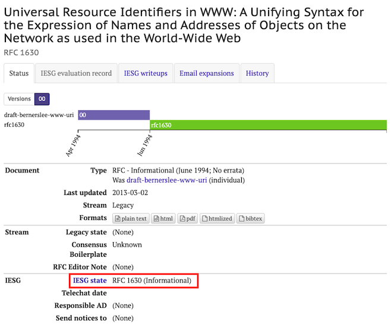
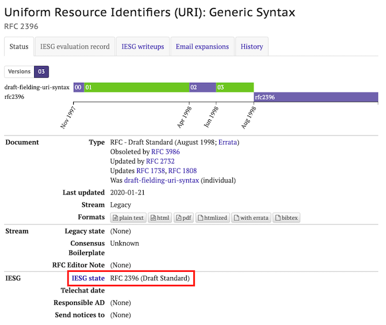
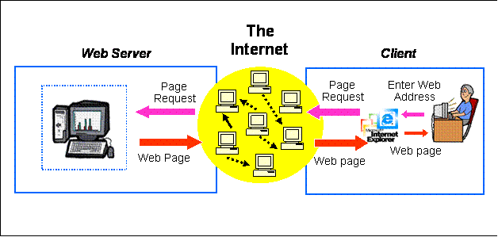
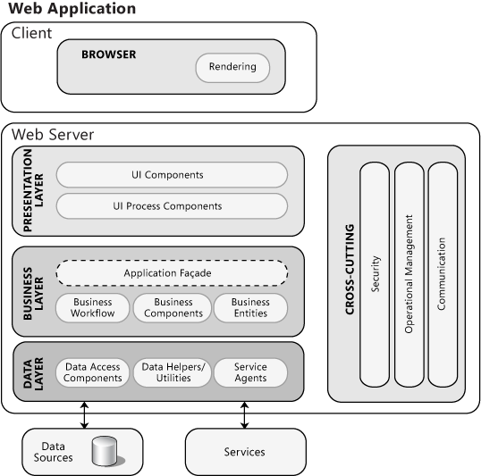
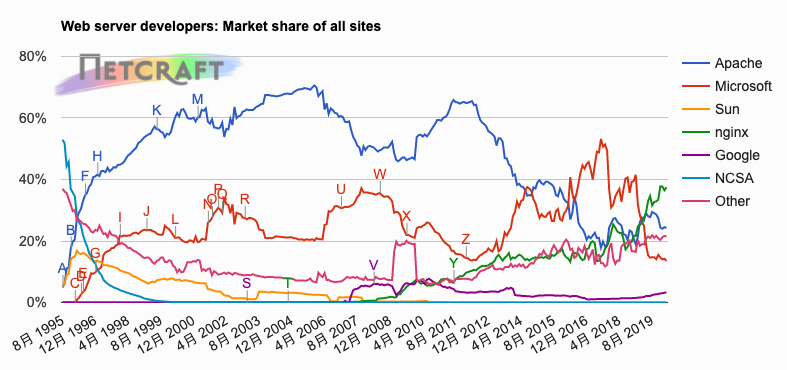
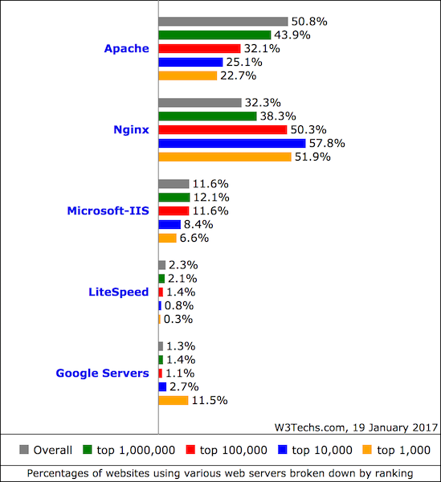
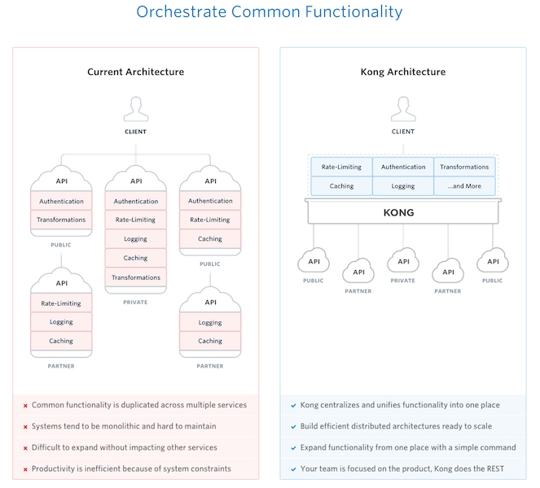
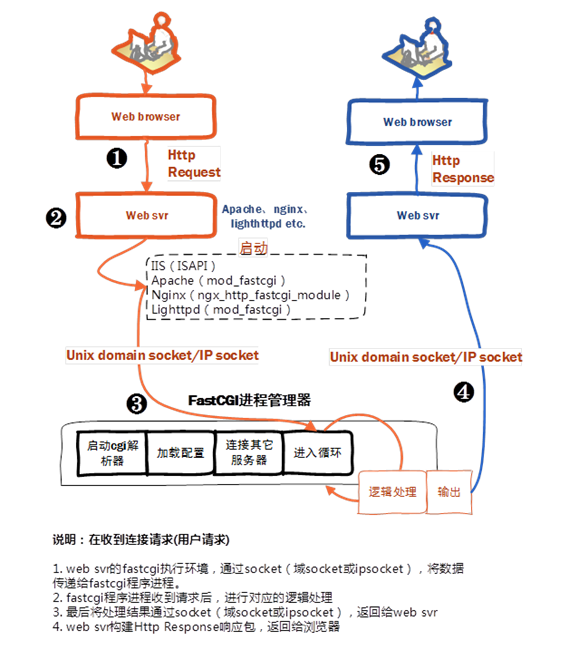

# 第五章：Web服务器

---

[The term "Cyberspace" started to become a de facto synonym for the Internet, and later the ***World Wide Web***](https://en.wikipedia.org/wiki/Cyberspace)

* 英国科学家Tim Berners-Lee在1989年发明了“万维网”（World Wide Web, 简称WWW或Web）
    * Web是一个信息空间，文档和其他Web资源使用URL(Uniform Resource Locator)标识并用超链接相互之间连接在一起，通过互联网访问到。

# WWW的技术内核

---

* URI: Universal Resource **Identifiers**
* URL: Universal Resource **Locators**
* HTML: HyperText Markup Language
* HTTP: HyperText Transfer Protocol

# RFC

---

* Request for Comments
* IETF（互联网工程任务组）发布的互联网相关备忘录
* [Not All RFCs are Standards ***RFC 1796***](https://datatracker.ietf.org/doc/rfc1796/?include_text=1)

> In fact, each RFC has a status, relative to its relation with the Internet standardization process: **Informational**, **Experimental**, or **Standards Track** (`Proposed Standard`, `Draft Standard`, `Internet Standard`), or **Historic**. 

---



---


---



# 协议族

---

* [**Universal** Resource **Identifiers** in WWW A Unifying Syntax for the Expression of Names and Addresses of Objects on the Network as used in the World-Wide Web ***RFC 1630***](https://datatracker.ietf.org/doc/rfc1630/)
* [**Uniform** Resource Identifiers (URI): Generic Syntax ***RFC 2396***](https://datatracker.ietf.org/doc/rfc2396/)
* [**Uniform** Resource **Locators** \(URL\) ***RFC 1738***](https://datatracker.ietf.org/doc/rfc1738/)

* [HTML 4.01 Specification W3C Recommendation 24 December 1999](https://www.w3.org/TR/html4/)
* [HTML5 by W3C](https://www.w3.org/TR/html5/)

---


* [Hypertext Transfer Protocol -- HTTP/1.0 ***RFC 1945***](https://datatracker.ietf.org/doc/rfc1945/)
* [Hypertext Transfer Protocol -- HTTP/1.1 ***RFC 2616***](https://datatracker.ietf.org/doc/rfc2616/)
* [Hypertext Transfer Protocol Version 2 \(HTTP/2\) ***RFC 7540***](https://datatracker.ietf.org/doc/rfc7540/)

---


* [HTTP Authentication: Basic and Digest Access Authentication ***RFC 2617***](https://datatracker.ietf.org/doc/rfc2617)
* [Use and Interpretation of HTTP Version Numbers ***RFC 2145***](https://datatracker.ietf.org/doc/rfc2145)
* [HTTP State Management Mechanism ***RFC 6265***](https://datatracker.ietf.org/doc/rfc6265)
* [An Extension to HTTP : Digest Access Authentication ***RFC 2069***](https://datatracker.ietf.org/doc/rfc2069)
* [The WebSocket Protocol ***RFC 6455***](https://datatracker.ietf.org/doc/rfc6455/)

# [关于URI / URL / URN / IRI等等标识符](https://www.w3.org/TR/2001/NOTE-uri-clarification-20010921/)

---

传统观点

* 90年代中期以前，人们认为URI的类型应该至少包括2类：资源地址（URL）和资源名称（URN, Uniform Resource Names）。彼时，URI就被分为2类：URL和URN。后来，有人又建议URI还可以标识元数据而不仅是资源本身。比如，提出了统一资源***引用***URC（***citation***）。因此，URI被认为应该进行命名空间划分：URL、URN和其他子命名空间。
    * 例如：**http:**是一个URL协议标识符，**isbn:**是一个URN协议标识符

---

现代观点

* 现代Web技术视角重新审视上述术语概念时认为：根据协议标识符来划分URI子（命名）空间已经没有必要了。Web标识用途的协议标识符都属于URI协议，**http:**和**urn:**都属于URI协议，区别就在于**命名空间**。URL就是一种特殊的URI，而且更被广泛使用在各种技术讨论场合。一个**http**协议的URI就是一个URL，URL协议主要就用来特指除去URN之类的URI。

---

IRI (International Resource Identifier)：URI语法的扩展，用来支持非ASCII字符集，例如UTF-8就是最为广泛支持的字符编码集合。

# 认识 [URL](https://datatracker.ietf.org/doc/rfc1738/)

---

> This document was written by the URI working group of the Internet Engineering Task Force.

完整定义详见「RFC 1738」 `5. BNF for specific URL schemes` 。

---

## URL 的一般形式

```
genericurl     = scheme ":" schemepart
```

---

```
scheme         = 1*[ lowalpha | digit | "+" | "-" | "." ]
schemepart     = *xchar | ip-schemepart
ip-schemepart  = "//" login [ "/" urlpath ]
```

- \* 表示「重复」0或多次后面的内容
- 1* 表示仅允许后面的内容出现 1 次

---

### 常见 scheme

* ftp - 文件传输协议（本课程第六章内容之一）
* http - 超文本传输协议
* mailto - 电子邮件地址
* file - 主机文件名

---

```
reserved       = ";" | "/" | "?" | ":" | "@" | "&" | "="
hex            = digit | "A" | "B" | "C" | "D" | "E" | "F" |
                 "a" | "b" | "c" | "d" | "e" | "f"
escape         = "%" hex hex

unreserved     = alpha | digit | safe | extra
uchar          = unreserved | escape
xchar          = unreserved | reserved | escape
```

---

## HTTP URL

以下内容摘录自「RFC 1738」`3.3. HTTP`

```
http://<host>:<port>/<path>?<searchpart>
```

* scheme - http
* schemepart - `//<host>:<port>/<path>?<searchpart>`

---

* host - 网络主机的 FQDN（Fully Qualified Domain Name） 或 IP 地址
* port - 端口号如果省略，则左边冒号必须一并省掉

---

### 大小写敏感?

* scheme - [不区分大小写](https://datatracker.ietf.org/doc/rfc2396/?include_text=1)
* host   - 不区分大小写
* path   - HTTP 服务器实现相关

> For resiliency, programs interpreting URI should treat upper case letters as equivalent to lower case in scheme names (e.g., allow "HTTP" as well as "http").

---

### 🌰 找不同 {id="url-example-1"} 

* https://git<font color='blue'>hub</font>.com/c4pr1c3/LinuxSysAdmin
* https://git<font color='red'>ee</font>.com/c4pr1c3/LinuxSysAdmin

---

### 🌰 找不同 {id="url-example-2"}

* https://c4pr1c3.git<font color='blue'>hub</font>.io/<font color='blue'>L</font>inux<font color='blue'>S</font>ys<font color='blue'>A</font>dmin/
* https://c4pr1c3.git<font color='red'>ee</font>.io/<font color='red'>l</font>inux<font color='red'>s</font>ys<font color='red'>a</font>dmin/


# Web技术架构

---

用户视角的基本Web技术架构

<a href="http://teaching.shu.ac.uk/aces/rh1/de/web_based_systems_architectures_1_tutorial.htm"></a>

---

组件视角的基本Web技术架构

<a href="https://msdn.microsoft.com/en-us/library/ee658099.aspx"></a>

# 服务器

---

NetCraft在2020年3月根据全球257,194,796个站点、1,263,025,546台服务器的信息统计结果绘制更新以下Web服务器市场占有率统计图

<a href="https://news.netcraft.com/archives/category/web-server-survey"></a>

---

[Alexa排名](http://www.alexa.com/)全球前1000万网站使用WEB服务器统计

<a href="https://w3techs.com/technologies/cross/web_server/ranking"></a>

---


据w3techs在2020年3月27日的统计数据表明：

* 在全球Top 1K 的网站中，有 62.4% 的网站在使用 Nginx（其中 20.3% 是用的[cloudflare-nginx](https://blog.cloudflare.com/end-of-the-road-for-cloudflare-nginx/)）
* 在全球Top 10K 的网站中，有 68.3%的网站在使用 Nginx（其中 28.2% 是用的[cloudflare-nginx](https://blog.cloudflare.com/end-of-the-road-for-cloudflare-nginx/)）
* 在全球Top 100K 的网站中，有 62.5% 的网站在使用 Nginx（其中 26.9% 是用的[cloudflare-nginx](https://blog.cloudflare.com/end-of-the-road-for-cloudflare-nginx/)）
* 在全球Top 10M 网站中，有 45.6% 的网站在使用 Nginx（其中 26.9% 是用的[cloudflare-nginx](https://blog.cloudflare.com/end-of-the-road-for-cloudflare-nginx/)）


---

](images/chap0x05/cloudflare-nginx.png)

---

[Cloudflare](https://www.cloudflare.com/zh-cn/network/china/) 是一家以全球「内容分发网络」（CDN）起家的公司，目前可以提供包括内容交付优化、Web 应用程序防火墙、分布式拒绝服务（DDoS）缓解、SSL 等多种互联网「安全增值」服务。根据 [nginx.com 上的一篇文章](https://www.nginx.com/success-stories/cloudflare-boosts-performance-stability-millions-websites-with-nginx/) 我们可以进一步了解到 `nginx` 在 `Cloudflare` 旗下 `CDN` 产品的广泛应用。

---

其他视角探索WEB服务器的市场占有率

* [使用Shodan探索HTTP服务类型的服务器返回结果](https://www.shodan.io/search?query=HTTP)
* [使用ZoomEye探索HTTP服务类型的服务器返回结果](https://www.zoomeye.org/search?q=+service%3Ahttp)

---

接下来，我们重点关注

* [nginx](https://nginx.org/)
    * [OpenResty](https://github.com/openresty/openresty)
    * [Kong](https://github.com/Mashape/kong)
    * [Tengine](http://tengine.taobao.org/)
    * [VeryNginx](https://github.com/alexazhou/VeryNginx)

# [nginx](http://nginx.org/en/)

---

核心特性列表

* HTTP服务器
* 邮件代理服务器
* TCP/UDP代理服务器

商业版支持[nginx plus](https://www.nginx.com/)

---

## nginx 衍生版代表 [OpenResty](https://github.com/openresty/openresty)

* OpenResty ™ 是一个基于 Nginx 与 Lua 的高性能 Web 平台
* 其内部集成了大量精良的 Lua 库、第三方模块以及大多数的依赖项
    * Web 开发人员和系统工程师可以使用 Lua 脚本语言调动 Nginx 支持的各种 C 以及 Lua 模块，快速构造出足以胜任 10K 乃至 1000K 以上单机并发连接的高性能 Web 应用系统。
* OpenResty 的目标是让你的Web服务直接跑在 Nginx 服务内部
    * 通过lua赋予Nginx更完备的在线可编程能力

---

## nginx 衍生版代表 [Kong](https://github.com/Mashape/kong)

基于OpenResty构建的API网关和微服务管理系统



---

## nginx 衍生版代表 [Tengine](http://tengine.taobao.org/)

Tengine是由淘宝网发起的Web服务器项目。它在Nginx的基础上，针对大访问量网站的需求，添加了很多高级功能和特性。Tengine的性能和稳定性已经在大型的网站如淘宝网，天猫商城等得到了很好的检验。它的最终目标是打造一个高效、稳定、安全、易用的Web平台。

从2011年12月开始，Tengine成为一个开源项目，Tengine团队在积极地开发和维护着它。Tengine团队的核心成员来自于淘宝、搜狗等互联网企业。


> 早期项目开发者中包括OpenResty项目的核心开发者，因此和OpenResty具有很多相同或相似特性（例如Lua支持）

---

## nginx 衍生版代表 [VeryNginx](https://github.com/alexazhou/VeryNginx)

VeryNginx基于lua_nginx_module(openrestry)开发，实现了高级的WEB防火墙、访问统计和其他的一些功能。集成在Nginx中运行，扩展了Nginx本身的功能，并提供了友好的Web交互界面。

# 应用程序服务器（支持服务器端脚本运行）

---

* PHP
    * PHP-FPM / Apache的mod_php / swoole
* nodejs（已内置）
* python
    * uwsgi兼容Web服务器 / wsgi兼容WEB服务器 / fastcgi兼容WEB服务器 / Apache的mod_python
* ruby
    * unicorn / Phusion Passenger

# CGI / FastCGI 

---

* CGI: Common Gateway Interface（通用网关接口）
    * CGI描述了客户端和这个程序之间传输数据的一种标准，是一种协议规范，独立于具体编程语言实现（只要这种语言具有标准输入、输出和环境变量）

---


---


---

* FastCGI：是CGI的一种改进方案，FastCGI像是一个常驻(long-lived)型的CGI， 它可以一直执行，在请求到达时不会花费时间去fork一个进程来处理(这是CGI最为人诟病的fork-and-execute模式)。
    * PHP-FPM（FastCGI Process Manager）：FastCGI协议的PHP版本实现，不需要和Web服务器在同一台物理主机上。

---


---



---


---

⚠️  [避免php-fpm进程被远程任意访问到](http://php.net/manual/zh/install.fpm.configuration.php)

[adoy/PHP-FastCGI-Client: This PHP class handles the communication with a FastCGI (FCGI) application using the FastCGI protocol.](https://github.com/adoy/PHP-FastCGI-Client)

# [Apache mod\_php](https://2bits.com/articles/apache-fcgid-acceptable-performance-and-better-resource-utilization.html)

---

* mod_php作为一个完整的PHP解释器内置在Apache服务的每一个工作进程之中
    * 优点
        * 安装和配置简单，开箱即用
        * 不需要像CGI模式那样去调用外部进程
        * 不需要像FastCGI模式那样通过socket去和外部进程通信
        * APC缓存被Apache所有子进程共享
    * 缺点
        * 每个工作进程都需要内置一个mod_php解释器，导致总体内存占用量较高
        * 对于静态文件访问服务的工作进程来说，也需要加载mod_php解释器


# 以nginx+php-fpm为例搭建一个Web站点

---

[How To Install WordPress with LEMP on Ubuntu 18.04](https://www.digitalocean.com/community/tutorials/how-to-install-wordpress-with-lemp-on-ubuntu-18-04)

# 客户端

---

* GUI 
    * 桌面、手机、平板等浏览器
* CLI
    * [curl](https://curl.haxx.se/) 、[wget](https://www.gnu.org/software/wget/) 、[httpie](https://httpie.org/) 等

---

## cURL是什么 {id='what-is-curl'}

以下摘自cURL的man手册页说明：

curl  is  a  tool to transfer data from or to a server, using one of the supported protocols (DICT, ***FILE***, FTP, FTPS, GOPHER, **HTTP**, **HTTPS**, IMAP, IMAPS, LDAP, LDAPS, POP3, POP3S, RTMP, RTSP, SCP, SFTP, SMB, SMBS, SMTP, SMTPS, TELNET and TFTP).  The command is designed to work without user interaction.

curl offers a busload of useful tricks like proxy support, user authentication, FTP upload, HTTP post, SSL connections, cookies, file transfer resume, Metalink, and more. As you will see below, the  number of features will make your head spin!

---

## HTTP是什么

以下摘自[RFC 2616](http://tools.ietf.org/rfc/rfc2616.txt):

The Hypertext Transfer Protocol (HTTP) is an **application-level** protocol for ***distributed***, ***collaborative***, ***hypermedia*** information systems. It is a generic, **stateless**, protocol which can be used for many tasks beyond its use for hypertext, such as ***name servers*** and ***distributed object management systems***, through ***extension of its request methods, error codes and headers*** [47]. A feature of HTTP is the typing and negotiation of data representation, allowing systems to be built independently of the data being transferred.

# HTTP in Action

---


```bash
# 标准HTTP GET请求标准静态Web Server
curl -v http://www.cuc.edu.cn

# 标准HTTP GET请求有前端缓存系统的静态Web Server
curl -v https://www.qq.com -o q.html 
curl -v https://www.taobao.com -o t.html

# 标准HEAD请求
curl -v -I http://www.cuc.edu.cn -o s.html

# 服务器端使用自定义HTTP响应头
curl -v https://www.baidu.com
curl -vv https://www.alipay.com

# 处理302和301重定向
curl -vv -L http://www.baidu.com

# 使用自定义User-Agent，绕过服务器端对客户端类型的检测和限制
curl -vv -L -A "Android 250.0" https://www.baidu.com -o baidu_a.html
curl -vv -L https://www.baidu.com -o baidu_c.html
# 比较使用不同User-Agent访问百度首页得到的页面差异
vimdiff baidu_a.html baidu_c.html

# GET传参
curl -vv 'https://www.baidu.com/s?ie=utf-8&f=8&rsv_bp=0&rsv_idx=1&tn=baidu&wd=%E4%BC%A0%E5%AA%92%E5%A4%A7%E5%AD%A6' -o baidu_cuc_curl.html -L
curl 'https://www.baidu.com/s?ie=utf-8&f=8&rsv_bp=0&rsv_idx=1&tn=baidu&wd=%E4%BC%A0%E5%AA%92%E5%A4%A7%E5%AD%A6' -H 'User-Agent: Mozilla/5.0 (Macintosh; Intel Mac OS X 10_12_2) AppleWebKit/537.36 (KHTML, like Gecko) Chrome/55.0.2883.95 Safari/537.36' -o baidu_cuc_mac.html -L
# 比较使用不同User-Agent进行百度搜索得到的结果差异
vimdiff baidu_cuc_curl.html baidu_cuc_mac.html

# 启用传输流压缩
curl -vv -H 'Accept-Encoding: gzip, deflate' https://www.baidu.com -o baidu.html.gz

# 使用自定义HTTP Request Header + POST表单数据
# TODO-1 请模拟学校教务处网站的登录表单完成命令行登录学校教务处任务
# TODO-2 模拟登录自己搭建的wordpress站点并使用curl发表一篇blog
```

注意到上面所有服务器设置的时间均使用到了一个关键词[**GMT**](http://baike.baidu.com/item/%E4%B8%96%E7%95%8C%E6%97%B6/692237)，简单来说这是为了解决全球不同地区的时区差异问题而进行的一项关于时间的标准化设置。

# 参考文献

---

* [World Wide Web from Wikipedia](https://en.wikipedia.org/wiki/World_Wide_Web)
* [Scalable Web Architecture and Distributed Systems](http://www.aosabook.org/en/distsys.html)
* [FastCGI Specification](http://www.mit.edu/~yandros/doc/specs/fcgi-spec.html)
* [FastCGI — The Forgotten Treasure](http://www.nongnu.org/fastcgi/)
* [Understanding and Implementing FastCGI Proxying in Nginx](https://www.digitalocean.com/community/tutorials/understanding-and-implementing-fastcgi-proxying-in-nginx)
* [Nginx + CGI/FastCGI + C/Cpp](http://www.cnblogs.com/skynet/p/4173450.html)
* [FastCGI on 深入理解PHP内核](http://www.php-internals.com/book/?p=chapt02/02-02-03-fastcgi)
* [mod_php vs FastCGI vs FPM vs CLI](https://www.slideshare.net/jacques_thekit/modphp-vs-fastcgi-vs-fpm-vs-cli)
* [A CGI application vulnerability for PHP, Go, Python and others](https://httpoxy.org/)

---

* [The Art Of Scripting HTTP Requests Using Curl](http://curl.haxx.se/docs/httpscripting.html)
* [Techniques for Mastering cUR](http://net.tutsplus.com/tutorials/php/techniques-and-resources-for-mastering-curl/)
* [curl and libcurl Vulnerabilities Table Overview](http://curl.haxx.se/docs/vulnerabilities.html)
* [Nginx 图形化配置文件生成工具](https://www.digitalocean.com/community/tools/nginx)

