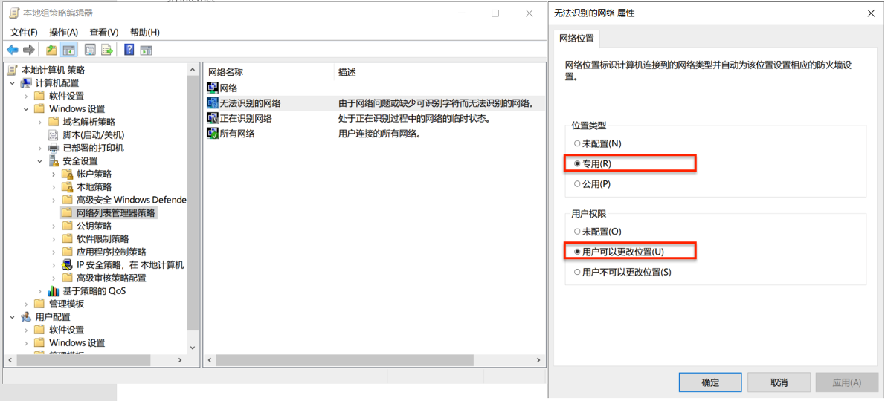
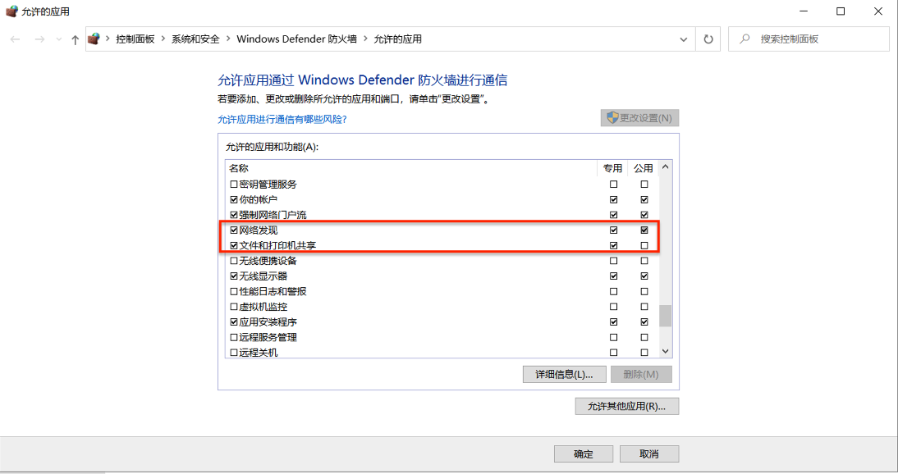
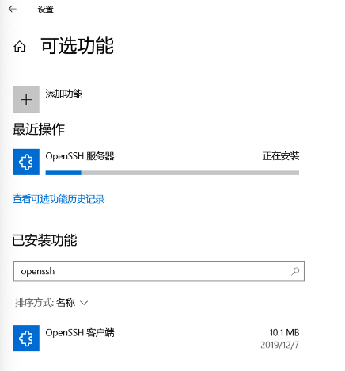

# 第六章：网络资源共享

---

## Keep Things Shared and Synchronized

# 经典文件共享服务

---

* FTP
* NFS
* SMB/CIFS

# [FTP](https://help.ubuntu.com/lts/serverguide/ftp-server.html.en)

---

> File Transfer Protocol (FTP) is a TCP protocol for downloading files between computers. In the past, it has also been used for uploading but, as that method does not use encryption, user credentials as well as data transferred in the clear and are easily intercepted. 

* 计算机之间**下载**文件之用
* 明文数据传输，易被拦截（篡改）
* **客户端/服务器**通信模型

---

常见FTP服务器软件

* ftpd
* vsftpd
* proftpd
* pure-ftpd

```bash
apt-cache show ftpd vsftpd proftpd-basic pure-ftpd | grep -A 5 Description-en

# ftpd: File Transfer Protocol (FTP) server This is the netkit ftp server. You are recommended to use one of its alternatives, such as vsftpd, proftpd, or pure-ftpd

# vsftpd: lightweight, efficient FTP server written for security This package provides the "Very Secure FTP Daemon", written from the ground up with security in mind.

# proftpd: Versatile, virtual-hosting FTP daemon - binaries ProFTPD is a powerful modular FTP/SFTP/FTPS server

# pure-ftpd: Secure and efficient FTP server Free, secure, production-quality and standard-conformant FTP server.
```

---

比较&选择？

Google: ftpd vsftpd proftpd pure-ftpd comparison

一些可供参考的评价因素：

* 功能特性是否满足需求
* 性能和可扩展性是否满足需求
* 安全性
    * [ftpd](https://www.cvedetails.com/product/9804/Ftpd-Ftpd.html?vendor_id=5802) / [vsftpd](https://www.cvedetails.com/product/3475/Beasts-Vsftpd.html?vendor_id=2041) / [proftpd](https://www.cvedetails.com/product/353/Proftpd-Project-Proftpd.html?vendor_id=204) / [pure-ftpd](https://www.cvedetails.com/vendor/2152/Pureftpd.html)

---

### 5W2H 理论指导技术方案选型 (1/2)

* What 功能特性列表、安全特性列表
* Why  需求优先级列表：功能和需求一次性匹配度（减少二次开发成本）、易用性、易维护性、性能、价格（一次性买断 or 订阅持续付费），孰先孰后？
* Who  项目的发起和维护者是谁？商业公司 or 开源社区 or 个人？
* Where 成功案例都有哪些？是否开源？不适合的场景有哪些？

---

### 5W2H 理论指导技术方案选型 (2/2)

* When 项目的最近一次更新时间？项目历史？
* How  项目技术栈？是否和当前需求场景使用的主要技术栈集成？
* How Much 性能？开发成本（人力投入、时间投入、授权费用、依赖软硬件采购费用等）

# FTP服务器配置任务 {id="ftp-configuration-task"}

---

请自行根据以下任务需求从以上FTP服务器软件中选择一款满足所有任务要求的FTP服务器进行安装配置实验

* [ ] 配置一个提供匿名访问的FTP服务器，匿名访问者可以访问1个目录且仅拥有该目录及其所有子目录的只读访问权限；
* [ ] 配置一个支持用户名和密码方式访问的账号，该账号继承匿名访问者所有权限，且拥有对另1个独立目录及其子目录完整读写（包括创建目录、修改文件、删除文件等）权限；
    * 该账号仅可用于FTP服务访问，不能用于系统shell登录；

***to be continued*** ...

---

***resumed***

* [ ] FTP用户不能越权访问指定目录之外的任意其他目录和文件；
* [ ] 匿名访问权限仅限白名单IP来源用户访问，禁止白名单IP以外的访问；
* [ ] （可选加分任务）使用FTPS服务代替FTP服务，上述所有要求在FTPS服务中同时得到满足；

# [NFS](https://help.ubuntu.com/16.04/serverguide/network-file-system.html)

---

NFS允许系统将其目录和文件共享给网络上的其他系统。通过NFS，用户和应用程序可以像访问本地文件一样访问远程系统上的文件。

---

## NFS服务器配置任务 {id="nfs-config-task"}

* [ ] 在1台Linux上配置NFS服务，另1台电脑上配置NFS客户端挂载2个权限不同的共享目录，分别对应只读访问和读写访问权限；
* [ ] 实验报告中请记录你在NFS客户端上看到的：
    * 共享目录中文件、子目录的属主、权限信息
    * 你通过NFS客户端在NFS共享目录中新建的目录、创建的文件的属主、权限信息
    * 上述共享目录中文件、子目录的属主、权限信息和在NFS服务器端上查看到的信息一样吗？无论是否一致，请给出你查到的资料是如何讲解NFS目录中的属主和属主组信息应该如何正确解读

***to be continued*** ...

---

***resumed***

* [ ] （可选任务）在客户端或NFS服务器上抓包分析使用NFS协议时的远程文件下载、上传、移动、删除等操作是否是明文？远程的文件传输数据流是否可以被恢复出完整的传输文件？

# SMB/CIFS {id="smbcifsheading"}

---

## SMB/CIFS —— 🌰


---

## [SMB与CIFS的关系](https://msdn.microsoft.com/zh-cn/library/windows/desktop/aa365233\(v=vs.85\).aspx)

> The Server Message Block (SMB) Protocol is a network file sharing protocol, and as implemented in Microsoft Windows is known as Microsoft SMB Protocol. The set of message packets that defines a particular version of the protocol is called a dialect. The Common Internet File System (CIFS) Protocol is a dialect of SMB. Both SMB and CIFS are also available on VMS, several versions of Unix, and other operating systems.

---

CIFS协议是SMB协议的一个本地化实现（dialect，直译为“方言”)，协议设计的初衷是文件共享，但微软的SMB协议还提供了一些额外功能：

* Dialect negotiation
* Determining other Microsoft SMB Protocol servers on the network, or network browsing
* Printing over a network
* File, directory, and share access authentication
* File and record locking
* File and directory change notification
* Extended file attribute handling
* Unicode support
* Opportunistic locks

---

* 按照OSI网络模型，微软SMB协议常被归类到应用层或表示层协议。
* 微软SMB数据传输通常使用NetBIOS over TCP/IP (NBT)，但仅仅是为了后向兼容性需要。实际上，这并不是SMB协议唯一的传输层协议选择。
* 微软SMB协议采用**客户端-服务器**模式实现，由一系列客户端请求和服务器响应数据构成：
    * 会话控制报文—和共享服务资源建立和断开连接
    * 文件访问报文—访问和控制远程服务器上文件和目录
    * 通用消息报文—发送数据到打印队列、邮件投递接口、命名管道，并提供打印队列状态信息

某些数据报文会分组打包在一次数据传输中以降低响应延迟和提高带宽利用率，这种方法被称为“批处理”。

# Samba {id="sambaheading"}

---

> [为Windows环境提供和整合常用服务](https://help.ubuntu.com/lts/serverguide/samba-introduction.html)

* **文件和打印机共享服务**。SMB协议可以使在网络上共享文件、文件夹、卷和打印机变得容易。
* **目录服务**。通过 LDAP(Lightweight Directory Access Protocol，轻量目录访问协议) 和 Microsoft Active Directory® 技术来共享网络计算机和用户的重要信息。
* **认证和权限**。建立网络计算机和用户的身份信息，并通过使用文件权限、组策略和 Kerberos 认证服务等原理和技术来确定计算机或用户可以访问的信息。

---

## [安装和配置Samba独立共享服务器](https://wiki.samba.org/index.php/Setting_up_Samba_as_a_Standalone_Server)

* Linux设置用户名密码方式的共享目录

```bash
# 安装Samba服务器
sudo apt-get install samba

# 创建Samba共享专用的用户
sudo useradd -M -s /sbin/nologin demoUser
sudo groupadd demoGroup
sudo usermod -a -G demoGroup demoUser
sudo passwd demoUser
# 创建的用户必须有一个同名的Linux用户，密码是独立的
sudo smbpasswd -a cuc

# 创建测试用共享目录
sudo mkdir -p /srv/samba/demo
sudo chown -R demoUser:demoGroup /srv/samba/demo
```

---

```ini
# 在/etc/samba/smb.conf 文件尾部追加以下“共享目录”配置
[demo]
        path = /srv/samba/demo/
        read only = no
        guest ok = no
        force create mode = 0660
        force directory mode = 2770
        force user = demoUser
        force group = demoGroup
# Forced Parameters 可以强制所有连接共享目录的用户创建的文件、目录使用特定的权限位设定、属主用户和属主组（有安全风险）
```

---

## smbclient

* 分别查看基于 Windows 和 Linux 搭建 SMB 共享服务包含的共享目录清单
* 向远程共享目录上传文件和目录
* 从远程共享目录中下载文件和目录

---

## smbclient 操作速查 {id="smbclient-faq"}

```bash
sudo apt-get install smbclient

# 查看远程 SMB 共享服务的共享目录清单
# Linux 搭建的 SMB 共享服务
smbclient -L 192.168.56.193 -U demoUser
# Enter WORKGROUP\demoUser's password:
# 
# 	Sharename       Type      Comment
# 	---------       ----      -------
# 	print$          Disk      Printer Drivers
# 	demo            Disk
# 	IPC$            IPC       IPC Service (cuc-lab server (Samba, Ubuntu))
# SMB1 disabled -- no workgroup available

# Windows 搭建的 SMB 共享服务
smbclient -L 192.168.56.182 -U demo
# Enter WORKGROUP\demo's password:
# 
# 	Sharename       Type      Comment
# 	---------       ----      -------
# 	anon_share      Disk
# 	IPC$            IPC       远程 IPC
# 	smb_share       Disk
# SMB1 disabled -- no workgroup available

# 连接指定共享目录
smbclient //192.168.56.193/demo -U cuc
# 输入密码

# 下载整个文件夹
tarmode
recurse
prompt
## 下载指定目录 target_dir
mget target_dir
## 下载所有目录和文件
mget *
```

# SMB 共享实验 FAQ {id="windows-share-faq"}

---

* 无法 ping 通 Windows 主机
* 设置使用非当前登录账号作为 SMB 共享用户
* 向共享目录写入文件失败

---

## 无法 ping 通 Windows 主机

* 检查「各层」网络连通性
* 排查 Windows 防火墙设置

---

### 配置 Windows 防火墙策略 {id="windows-fw-config-0"}

* `开始菜单` --> `gpedit.msc` --> `Windows 设置` --> `安全设置` --> `网络列表管理器策略` --> `无法识别的网络`
    * 位置类型：专用
    * 用户权限：用户可以更改位置

---

### 配置 Windows 防火墙策略 {id="windows-fw-config-1"}



---

### 配置 Windows 防火墙策略 {id="windows-fw-config-2"}



---

## 设置使用非当前登录账号作为 SMB 共享用户

```bash
# 在 Windows CMD 中输入以下命令完成用户添加与口令设置
# 添加用户 demo 密码为 pass 用于访问共享文件夹
net user demo pass /ADD

# 实验完毕 删除用户
net user demo /DELETE
```

---

## 向共享目录写入文件失败

* 目录写入权限设置检查
* `put` 只支持上传 **当前目录下** 文件
* 在 SMB 交互式终端中通过 `!` 命令前缀执行本地 `shell` 命令

```bash
smb: \> ls
#   .                                   D        0  Thu Apr 22 05:38:17 2021
#   ..                                  D        0  Thu Apr 22 05:38:17 2021
#   upload_demo                         A       12  Fri Apr 16 03:16:19 2021
#   新建文件夹                     D        0  Thu Apr 22 06:57:22 2021
# 
#                 33405695 blocks of size 4096. 21963037 blocks available
smb: \> !ls -la
# total 52
# drwxr-xr-x 6 cuc  cuc  4096 Apr 22 23:09 .
# drwxr-xr-x 3 root root 4096 Feb 20 11:21 ..
# drwx------ 3 cuc  cuc  4096 Apr 12 01:31 .ansible
# -rw------- 1 cuc  cuc  2472 Apr 22 07:53 .bash_history
# -rw-r--r-- 1 cuc  cuc   220 Feb 25  2020 .bash_logout
# -rw-r--r-- 1 cuc  cuc  3789 Apr 12 06:40 .bashrc
# drwx------ 2 cuc  cuc  4096 Feb 20 11:43 .cache
# -rw------- 1 cuc  cuc    39 Apr 22 06:33 .lesshst
# -rw-r--r-- 1 cuc  cuc   807 Feb 25  2020 .profile
# drwx------ 2 cuc  cuc  4096 Apr 12 01:31 .ssh
# -rw-r--r-- 1 cuc  cuc     0 Feb 20 11:44 .sudo_as_admin_successful
# -rw-rw-r-- 1 cuc  cuc     0 Apr 22 23:09 test
# -rw-rw-r-- 1 cuc  cuc    12 Apr 22 06:02 upload_demo
# -rw------- 1 cuc  cuc   867 Apr 22 06:18 .viminfo
# drwxrwxr-x 3 cuc  cuc  4096 Apr 22 06:57 新建文件夹

smb: \> help lcd
# HELP lcd:
# 	[directory] change/report the local current working directory
```

---

### 目录写入权限设置检查

```bash
# Linux 宿主机
ls -ld /srv/samba/demo/
# drwxr-xr-x 2 demoUser demoGroup 4096 Apr 22 05:35 /srv/samba/demo/

# Windows 宿主机

```

# 远程管理 Windows 主机简介 {id="windows-rm-intro"}

---

## 常见远程管理方式

* GUI: Windows 远程桌面
* CLI
    * [Powershell Remote](https://docs.microsoft.com/en-us/powershell/scripting/learn/remoting/running-remote-commands)
    * [SSH](https://docs.microsoft.com/en-us/windows-server/administration/openssh/openssh_overview)

---

### Windows 远程桌面 {id="windows-rdp"}

* [微软官方文档: 如何使用远程桌面 Windows 10](https://support.microsoft.com/zh-cn/windows/%E5%A6%82%E4%BD%95%E4%BD%BF%E7%94%A8%E8%BF%9C%E7%A8%8B%E6%A1%8C%E9%9D%A2-5fe128d5-8fb1-7a23-3b8a-41e636865e8c)
* [Windows 10 Home 版开启远程桌面: stascorp/rdpwrap](https://github.com/stascorp/rdpwrap)

---

### CLI - OpenSSH Server {id="sshd-configure-1"}

* 安装 Windows 可选功能组件：`OpenSSH Server`



---

### CLI - OpenSSH Server {id="sshd-configure-2"}

* 启动并配置 `OpenSSH Server` 开机自启动

```bash
# 以下代码需要在「管理员权限」的 PowerShell 中执行
Start-Service sshd
# OPTIONAL but recommended:
Set-Service -Name sshd -StartupType 'Automatic'
# Confirm the firewall rule is configured. It should be created automatically by setup.
Get-NetFirewallRule -Name *ssh*
# There should be a firewall rule named "OpenSSH-Server-In-TCP", which should be enabled
# If the firewall does not exist, create one
New-NetFirewallRule -Name sshd -DisplayName 'OpenSSH Server (sshd)' -Enabled True -Direction Inbound -Protocol TCP -Action Allow -LocalPort 22
```

---

### CLI - OpenSSH Server {id="sshd-configure-3"}

* 配置 OpenSSH 客户端连接后启动的默认 Shell 为 `PowerShell`

```bash
# 以下代码需要在「管理员权限」的 PowerShell 中执行
New-ItemProperty -Path "HKLM:\SOFTWARE\OpenSSH" -Name DefaultShell -Value "C:\Windows\System32\WindowsPowerShell\v1.0\powershell.exe" -PropertyType String -Force
```

---

### CLI - OpenSSH Server {id="sshd-configure-4"}

* 配置 SSH 免密登录

```bash
# 不能使用 ssh-copy-id

# 在「管理员权限」的 powershell 中执行以下命令
cd $ENV:PROGRAMDATA/ssh
New-Item -ItemType file administrators_authorized_keys

# 将公钥指纹信息写入上述新创建的 administrators_authorized_keys
# 请自行替换以下 <> 内的公钥指纹信息
# 这里的 -encoding ascii 非常重要，因为默认不使用该参数时
# Out-File 写入的文本是双字节编码且使用了 BOM 文件头
echo '<content-of-id_rsa.pub>' | Out-File -encoding ascii administrators_authorized_keys

# 检查自己使用的 PowerShell 版本
# $PSVersionTable

# Name                           Value
# ----                           -----
# PSVersion                      5.1.19041.906
# PSEdition                      Desktop
# PSCompatibleVersions           {1.0, 2.0, 3.0, 4.0...}
# BuildVersion                   10.0.19041.906
# CLRVersion                     4.0.30319.42000
# WSManStackVersion              3.0
# PSRemotingProtocolVersion      2.3
# SerializationVersion           1.1.0.1

# ref: https://docs.microsoft.com/en-us/powershell/module/microsoft.powershell.utility/out-file?view=powershell-5.1
# 5.1 版 Powershell 使用 Out-File 写入文件时所有多字节编码方式均用到了 BOM 头

# ref: https://docs.microsoft.com/en-us/powershell/module/microsoft.powershell.utility/out-file?view=powershell-7
# 7.0+ 版 Powershell 提供了 utf8NoBOM 编码方式

# 配置上述 administrators_authorized_keys 正确的属主和访问权限
$acl = Get-Acl $ENV:PROGRAMDATA\ssh\administrators_authorized_keys
$acl.SetAccessRuleProtection($true, $false)
$administratorsRule = New-Object system.security.accesscontrol.filesystemaccessrule("Administrators","FullControl","Allow")
$systemRule = New-Object system.security.accesscontrol.filesystemaccessrule("SYSTEM","FullControl","Allow")
$acl.SetAccessRule($administratorsRule)
$acl.SetAccessRule($systemRule)
$acl | Set-Acl

# 检查 administrators_authorized_keys 文件的权限设置
# Access 一项只能且必须只有 
# Access : NT AUTHORITY\SYSTEM Allow  FullControl
#          BUILTIN\Administrators Allow  FullControl
get-acl .\administrators_authorized_keys | fl
# Path   : Microsoft.PowerShell.Core\FileSystem::C:\ProgramData\ssh\administrators_authorized_keys
# Owner  : BUILTIN\Administrators
# Group  : DESKTOP-HQOR9HG\None
# Access : NT AUTHORITY\SYSTEM Allow  FullControl
#          BUILTIN\Administrators Allow  FullControl
# Audit  :
# Sddl   : O:BAG:S-1-5-21-3489025807-4051503630-1690866609-513D:PAI(A;;FA;;;SY)(A;;FA;;;BA)
```

---

### CLI - OpenSSH Server {id="sshd-configure-5"}

* 从 Linux 主机获取开启 OpenSSH Server 的 Windows 主机上的文件

```bash
# 注意 Windows 路径分隔符要使用 / 而不是 \
scp demo@192.168.56.182:c:/programdata/ssh/administrators_authorized_keys ./
```

# 移动互联时代的文件共享

---

## 功能特性

* 多终端平台支持: PC / macOS / iOS / Android / ...
* 文件变更自动在多终端平台同步
* **加分点** 加密和隐私保护
* **加分点** 支持数据的物理存储自己管理

---

## 开源解决方案

* [自建文件传输/同步解决方案](https://github.com/awesome-selfhosted/awesome-selfhosted#file-transfersynchronization)
    * [ownCloud](https://owncloud.org/)
    * [Seafile](https://www.seafile.com/home/)
    * [Syncthing](https://syncthing.net/)

# 参考文献

---

* [FTP Server from Ubuntu Official Documentation](https://help.ubuntu.com/lts/serverguide/ftp-server.html)
* [How To Set Up an NFS Mount on Ubuntu 16.04](https://www.digitalocean.com/community/tutorials/how-to-set-up-an-nfs-mount-on-ubuntu-16-04)
* [Samba from Ubuntu Official Documentation](https://help.ubuntu.com/lts/serverguide/samba.html.en)
* [Samba/SambaClientGuide from Ubuntu Official Documentation](https://help.ubuntu.com/community/Samba/SambaClientGuide)
* [Setting up Samba as a Standalone Server from Samba Official Wiki](https://wiki.samba.org/index.php/Setting_up_Samba_as_a_Standalone_Server)
* [Mounting samba shares from a unix client from Samba Official Wiki](https://wiki.samba.org/index.php/Mounting_samba_shares_from_a_unix_client)
* [Microsoft SMB Protocol and CIFS Protocol Overview from MSDN](https://msdn.microsoft.com/zh-cn/library/windows/desktop/aa365233\(v=vs.85\).aspx)

