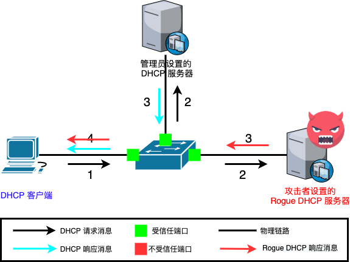
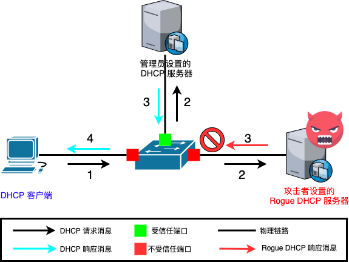
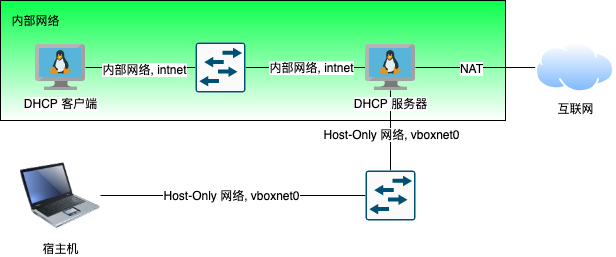

# 第七章：DHCP与DNS服务

---

## Just Get Network Works

# [动态主机配置协议 (DHCP)](https://help.ubuntu.com/lts/serverguide/dhcp.html)

---

动态主机配置协议 (DHCP) 是一种网络服务，相对于手工为每台网络主机配置，它使网络主机可能自动被服务器指定设置。被配置成 DHCP 客户端的计算机并不能控制其从 DHCP 服务器得到的设置，且该配置对于计算机用户来说是透明的。

由 DHCP 服务器提供给 DHCP 客户端最常用的设置包括：

* IP地址和子网掩码
* 默认网关IP地址
* （本地）DNS解析服务器IP地址

---

一个 DHCP 服务器也支持配置如下属性，如：

* 主机名 / 域名
* NTP时间服务器
* 打印服务器

# DHCP服务器的常见客户端地址配置策略

---

**手工分配（基于客户端网卡MAC地址）**

DHCP服务器根据网络中每个联网网卡的物理地址为其提供一个固定的配置，当使用该网卡的客户端发起DHCP请求时可以确保客户端网络地址自动配置的确定性。

---

**动态分配（基于地址池）**

DHCP服务器从一个地址池（有时又被称为一个地址段或区间）选择一个IP地址，根据服务器配置保留一段时间或租期内有效，或者客户端主动通知服务器该地址已不再被使用。在这种策略之下，客户端按照“先到先得”原则动态获取网络配置信息。当一个DHCP客户端在该网络中离线一段时间，该配置将自动过期并被释放回地址池用于分配给其他DHCP客户端。这种方法获得的地址可被租用或使用一段时间，过期之后客户端需要重新和服务器协商保留该地址的使用权。

---

**自动分配**

DHCP服务器通常是给客户端分配一个临时地址，但也能设置有效期为永不过期，从而达到客户端既能自动获取IP地址又能永久使用的效果。

---

## [Rogue DHCP](https://en.wikipedia.org/wiki/Rogue_DHCP)



---

## 防御 [Rogue DHCP: DHCP snooping](https://en.wikipedia.org/wiki/DHCP_snooping)



# [DNS](https://help.ubuntu.com/lts/serverguide/dns.html)

---

DNS(域名解析服务)是将IP地址与FQDN(fully qualified domain name，全称域名)相互转换的一种互联网服务。

---

## ***BIND9***服务的主要角色

When configured as a caching nameserver BIND9 will find the answer to name queries and remember the answer when the domain is queried again.

As a primary master server BIND9 reads the data for a zone from a file on it's host and is authoritative for that zone.

In a secondary master configuration BIND9 gets the zone data from another nameserver authoritative for the zone.

# 常见DHCP服务器

---

* dnsmasq
* isc-dhcp-server

# 常见DNS服务器 {id="dns-common-svrs"}

---

* dnsmasq
* isc-dhcp-server
* bind9

# 以 dnsmasq 配置为例 {id="dnsmasq-example"}

---

## 实验网络拓扑配置 {id="dnsmasq-network-layout-1"}

* `dhcp-server`
    * 网卡1：NAT
    * 网卡2：Host-only
    * 网卡3：内部网络
* `dhcp-client`
    * 网卡1：内部网络

---

## 实验网络拓扑配置 {id="dnsmasq-network-layout-2"}



---

## 主要操作步骤

```bash
# 安装 dnsmasq
sudo apt update && sudo apt install -y dnsmasq

# 如果遇到如下错误提示信息
# Job for dnsmasq.service failed because the control process exited with error code.
# See "systemctl status dnsmasq.service" and "journalctl -xe" for details.
# invoke-rc.d: initscript dnsmasq, action "start" failed.
# ● dnsmasq.service - dnsmasq - A lightweight DHCP and caching DNS server
#      Loaded: loaded (/lib/systemd/system/dnsmasq.service; enabled; vendor preset: enabled)
#           Active: failed (Result: exit-code) since Mon 2021-05-03 02:41:17 UTC; 11ms ago
#               Process: 17812 ExecStartPre=/usr/sbin/dnsmasq --test (code=exited, status=0/SUCCESS)
#                   Process: 17813 ExecStart=/etc/init.d/dnsmasq systemd-exec (code=exited, status=2)
# 
#                   May 03 02:41:16 cuc-lab systemd[1]: Starting dnsmasq - A lightweight DHCP and caching DNS server...
#                   May 03 02:41:16 cuc-lab dnsmasq[17812]: dnsmasq: syntax check OK.
#                   May 03 02:41:17 cuc-lab dnsmasq[17813]: dnsmasq: failed to create listening socket for port 53: Address already in use
#                   May 03 02:41:17 cuc-lab dnsmasq[17813]: failed to create listening socket for port 53: Address already in use
#                   May 03 02:41:17 cuc-lab dnsmasq[17813]: FAILED to start up
#                   May 03 02:41:17 cuc-lab systemd[1]: dnsmasq.service: Control process exited, code=exited, status=2/INVALIDARGUMENT
#                   May 03 02:41:17 cuc-lab systemd[1]: dnsmasq.service: Failed with result 'exit-code'.
#                   May 03 02:41:17 cuc-lab systemd[1]: Failed to start dnsmasq - A lightweight DHCP and caching DNS server.

# 检查 53 端口监听占用情况
sudo lsof -i -P -L -n | grep 53
# systemd-r   606 systemd-resolve   12u  IPv4  20740      0t0  UDP localhost:53
# systemd-r   606 systemd-resolve   13u  IPv4  20741      0t0  TCP localhost:53 (LISTEN)

# ref: https://unix.stackexchange.com/questions/304050/how-to-avoid-conflicts-between-dnsmasq-and-systemd-resolved/358485
# 禁用 systemd-resolved 内置的 DNS 解析服务 
sudo sed -i.bak "s/#DNSStubListener=yes/DNSStubListener=no/g" /etc/systemd/resolved.conf
# 修改上述配置选项后重启 systemd-resolved 服务使得配置生效
sudo systemctl restart systemd-resolved

# 再次检查 53 端口监听占用情况
sudo lsof -i -P -L -n | grep 53

# 编辑 /etc/dnsmasq.conf
# 配置 dnsmasq 只监听在「内部网络」网卡上
# 本实验中对应网卡名称 enp0s9
# 先将配置代码写入临时文件
# 建议使用宿主机本地默认域名解析服务器地址，此处 114.114.114.114 仅作为示例
cat << EOF > /tmp/dnsmasq.conf
interface=enp0s9
server=114.114.114.114 
dhcp-range=172.16.233.50,172.16.233.150,255.255.255.0,240h
EOF
# 然后合并临时文件内容追加到 /etc/dnsmasq.conf
cat /tmp/dnsmasq.conf | sudo tee -a /etc/dnsmasq.conf

# 手动配置 enp0s9 为固定 IP
# 先将配置代码写入临时文件
cat << EOF > /tmp/01-dhcp.yaml
network:
  ethernets:
    enp0s9:
      addresses:
        - 172.16.233.1/24
  version: 2
EOF
# 保存配置文件到指定目录
sudo cp /tmp/01-dhcp.yaml /etc/netplan/01-dhcp.yaml
# 使新配置网卡配置生效
sudo netplan apply

# 启用 dnsmasq 服务
sudo systemctl start dnsmasq

# 启动 dhcp-client 测试 DHCP 和 DNS 服务是否生效
```

---

## 主要操作步骤录屏

[](https://asciinema.org/a/44LfKzCs9JoT6RSWOnlcBO4ss)

# 参考文献

---

* [Dynamic Host Configuration Protocol from Ubuntu Official Documentation](https://help.ubuntu.com/lts/serverguide/dhcp.html)
* [DNS from Ubuntu Official Documentation](https://help.ubuntu.com/lts/serverguide/dns.html)

