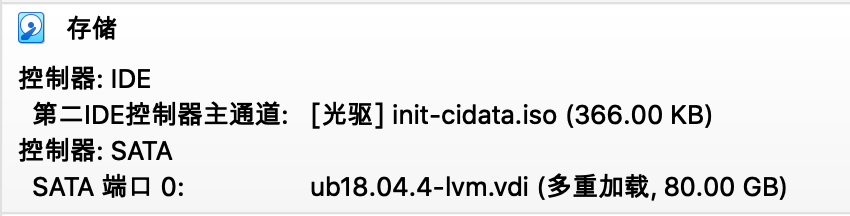
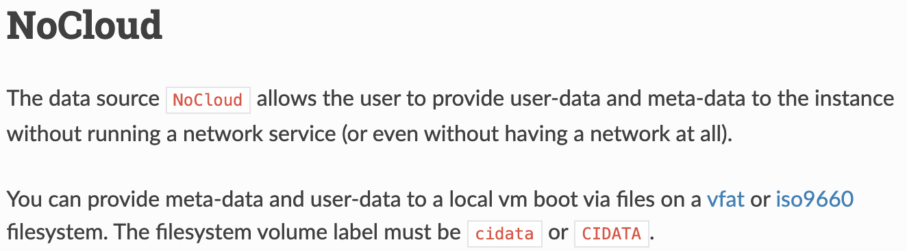
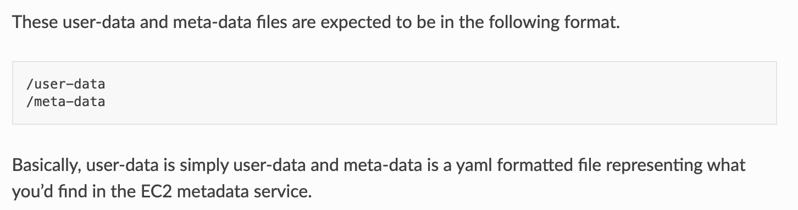

# 番外：Cloud-Init

---

* `ansible` 的使用对目标运行环境也有依赖要求
    * Python 解释器
    * SSH 免密登录
* 以 `puppet` 为代表的基于 `agent` 的自动化管理系统方案需要在「基础镜像」中提前安装好对应的 `agent` 并进行运行时环境相关的必要配置

---

> 以上需求可以通过在定制「基础镜像」阶段将上述依赖软件预装在系统中

---

> 但是，上述做法并不「优雅」。

---

「基础镜像」应该满足以下特性：

* 最大化「可复用」场景：最小化安装系统，只装「最普遍需要」的基础软件

---

考虑以下集群服务器管理的常见需求：

* 新安装的系统需要预先配置不同用户的不同 SSH 免密登录受信任公钥
* 部分新系统需要安装软件A，另一部分新系统需要安装软件B

---

以上需求对应的操作过程均要求 **自动化** 。

---

这就是 `从一到二、到三，乃至万物` 的 **自动化** 问题。

---

> 怎么解决 `从一到二、到三，乃至万物` 的 **自动化** 问题？

---

## Cloud-Init 的作用 {id="cloud-init-usage"}

> 解决 `从一到二、到三，乃至万物` （从基本系统到可编程、可配置） 的 **自动化** 问题

# 从「第一个 🌰 」开始体验 cloud-init {id="hello-cloud-init"}

---

```bash
# 在制作无人值守安装镜像或 PXE 镜像时将 cloud-init 和 openssh-server 预装
sudo apt update && sudo apt install cloud-init genisoimage

mkdir -p ~/workspace/cloud-init && cd ~/workspace/cloud-init 

cat << EOF > ~/workspace/cloud-init/meta-data
instance-id: 1
local-hostname: cuc-cloud-init
EOF

cat << EOF > ~/workspace/cloud-init/user-data
#cloud-config
password: mypassword 
chpasswd: { expire: False }
ssh_pwauth: True
EOF

genisoimage -output init-cidata.iso -volid cidata -joliet -rock user-data meta-data
```

---

* 将虚拟机内的 `init-cidata.iso` 下载到宿主机系统
* 在 Virtualbox 的当前虚拟机设置界面挂载 `init-cidata.iso`



---

重启 `当前虚拟机` ，登录进入系统后：

```bash
# 系统的主机名变成了上述配置文件示例里的 cuc-cloud-init

# 查看系统中会新多出一个用户 `ubuntu` 
id ubuntu

# 输入上述配置文件示例里设置的口令 `mypassword` 
su ubuntu

# 检查当前用户身份
id
```

# 详解上一个🌰

---

## user-data

```yaml
#cloud-config
```

* 标识当前文件是一个 `cloud-config` 类型文件，这是最常用的一类 `User-Data`

---

```yaml
password: mypassword 
```

`Ubuntu` 发行版默认创建的用户名为 `ubuntu`，此处 `password` 指令等价于先创建新用户 `ubuntu` ，然后设置口令为 `mypassword` 。

* [users 配置关键字定义的列表中第一个用户就是系统的默认用户，如果希望保留发行版默认标准用户名则第一个用户应设置为 default](https://cloudinit.readthedocs.io/en/latest/topics/modules.html#users-and-groups) 。
* 口令格式既可以是明文，也可以是 `mkpasswd` 创建的「哈希后口令」。

---

## 创建「哈希后口令」的🌰

```bash
sudo apt install whois
mkpasswd -m help # 获取当前版本支持的哈希算法
mkpasswd -m sha-512 mypassword
```

---

```yaml
chpasswd: { expire: False }
```

`chpasswd` 用于对系统中 **已有** 用户更改口令或设置口令强制过期策略。支持 `expire` 和 `list` 属性。其中 `list` 关键字支持 `username:password` 列表形式，既可以是 `YAML list` 格式，也可以是「一行一键值对」的 `多行` 字符串。

---

```yaml
ssh_pwauth: True
```

`ssh_pwauth` 配置 `/etc/ssh/sshd_config` 里 `PasswordAuthentication` 字段值。

# 正式入门

---

## [必读：官方文档](https://cloudinit.readthedocs.io/en/latest/index.html)

* 工业级标准（[主流 Linux 发行版、公有云服务提供商、私有云平台、裸机安装](https://cloudinit.readthedocs.io/en/latest/topics/availability.html)）
* 支持从多种「数据源」加载用户配置，定制从「基础镜像」到「个性化可用系统」的自动化实现

---

| 支持的发行版 | 支持的公有云 | 支持的私有云 |
| --- | --- | --- |
| Ubuntu<br />SLES/openSUSE<br />RHEL/CentOS<br />Fedora<br />Gentoo Linux<br />Debian<br />ArchLinux<br />FreeBSD<br />NetBSD<br />OpenBSD<br /><br /><br /><br /><br /><br /><br /><br /><br /><br /><br /> | Amazon Web Services<br />Microsoft Azure<br />Google Cloud Platform<br />Oracle Cloud Infrastructure<br />Softlayer<br />Rackspace Public Cloud<br />IBM Cloud<br />Digital Ocean<br />Bigstep<br />Hetzner<br />Joyent<br />CloudSigma<br />Alibaba Cloud<br />OVH<br />OpenNebula<br />Exoscale<br />Scaleway<br />CloudStack<br />AltCloud<br />SmartOS<br />HyperOne<br />Rootbox<br /> | Bare metal installs<br />OpenStack<br />LXD<br />KVM<br />Metal-as-a-Service (MAAS)<br /><br /><br /><br /><br /><br /><br /><br /><br /><br /><br /><br /><br /><br /><br /><br />|

# 查看当前已安装 Cloud-Init 版本 {id="check-cloud-init-version"}

---

```bash
cloud-init --version
# /usr/bin/cloud-init 19.4-33-gbb4131a2-0ubuntu1~18.04.1
```

根据以上版本信息，推荐阅读[官方 v19.4 版文档](https://cloudinit.readthedocs.io/en/19.4/index.html) 。

# [数据源](https://cloudinit.readthedocs.io/en/19.4/topics/datasources.html)

---

* 「数据源」指的是 `cloud-init` 的配置数据来源，通常来自用户（例如 `user-data`）或来自创建配置驱动器的云（例如 `meta-data` ）。 
* 典型的「用户数据」包括「文件」，「yaml」和「Shell 脚本」
* 典型的「元数据」包括「服务器名称」，「实例 ID」，「显示名称」和「其他特定于云服务提供商」的详细信息

---

实例（Instance）在云计算场景中，一般指「云主机实例」。对于 `Virtualbox` 来说，每一个本地虚拟机也可以看作是一个「实例」。

---

当前系统上执行过 `Cloud-Init` 之后会将「元数据」保存在 `/run/cloud-init/instance-data.json` ，如下所示是「第一个 🌰 」对应的「元数据」：

```json
{
 "base64_encoded_keys": [],
 "ds": {
  "_doc": "EXPERIMENTAL: The structure and format of content scoped under the 'ds' key may change in subsequent releases of cloud-init.",
  "meta_data": {
   "dsmode": "net",
   "instance-id": 1,
   "local-hostname": "cuc-cloud-init"
  }
 },
 "sensitive_keys": [],
 "v1": {
  "_beta_keys": [
   "subplatform"
  ],
  "availability-zone": null,
  "availability_zone": null,
  "cloud-name": "unknown",
  "cloud_name": "unknown",
  "instance-id": "1",
  "instance_id": "1",
  "local-hostname": "cuc-cloud-init",
  "local_hostname": "cuc-cloud-init",
  "platform": "nocloud",
  "public_ssh_keys": [],
  "region": null,
  "subplatform": "config-disk (/dev/sr0)"
 }
}
```

---

[已知支持数据源类型](https://cloudinit.readthedocs.io/en/19.4/topics/datasources.html#known-sources)

| 排                     | 名                    | 不       | 分          | 先后               |
| ---                    | ---                   | ---      | ---         | ---                |
| Alibaba Cloud (AliYun) | Alt Cloud             | Azure    | CloudSigma  | CloudStack         |
| Config Drive           | Digital Ocean         | E24Cloud | Amazon EC2  | Exoscale           |
| Fallback/None          | Google Compute Engine | MAAS     | **NoCloud** | OpenNebula         |
| OpenStack              | Oracle                | OVF      | Rbx Cloud   | SmartOS Datasource |
| ZStack                 |                       |          |             |                    |

---

## 查看我们在虚拟机里使用的数据源类型

```bash
cloud-id
# nocloud
```

# [NoCloud](https://cloudinit.readthedocs.io/en/19.4/topics/datasources/nocloud.html#nocloud)

---

回顾之前我们创建 iso 镜像文件时使用的命令

```bash
genisoimage -output init-cidata.iso -volid cidata -joliet -rock user-data meta-data
```

* `-volid cidata` 指定新创建的 iso 文件的「卷标识」为 `cidata`



---

回顾之前我们创建 iso 镜像文件时使用的命令

```bash
genisoimage -output init-cidata.iso -volid cidata -joliet -rock user-data meta-data
```



* iso 镜像文件里的文件名必须是 `user-data` 和 `meta-data`

---

回顾之前的 `meta-data` 文件内容

```yaml
instance-id: 1
local-hostname: cuc-cloud-init
```

其中 `instance-id: 1` 用来告诉 `cloud-init` 引擎该实例「是否首次启动」。

```bash
# 查看该实例启动过一次之后在当前系统内留下的痕迹
ls /var/lib/cloud/instances/1/
# boot-finished     datasource  obj.pkl  sem            user-data.txt.i  vendor-data.txt.i
# cloud-config.txt  handlers    scripts  user-data.txt  vendor-data.txt
```

---

其中 `boot-finished` 文件记录了该实例定义的启动时间，例如：

```bash
cat /var/lib/cloud/instances/1/boot-finished
# 11.28 - Tue, 14 Apr 2020 07:33:47 +0000 - v. 19.4-33-gbb4131a2-0ubuntu1~18.04.1
```

---

当上述目录结构存在时，只要 `init-cidata.iso` 内容不变。即使一直挂载在虚拟机的光驱里，每次启动虚拟机系统时，也不会再重新执行一遍光盘里定义的 `cloud-init` 操作了。

---

如果希望重新执行 `init-cidata.iso` 里定义的操作，需要变更 `meta-data` 文件里的 `instance-id` 赋值为 `/var/lib/cloud/instances/` 下不存在重名子目录的其他值。

# [调试 user-data](https://cloudinit.readthedocs.io/en/19.4/topics/faq.html#how-can-i-debug-my-user-data) {id="debug-user-data"}

---

```bash
# 验证 user-data 文件是否存在语法错误
cloud-init devel schema -c user-data --annotate
# Valid cloud-config file user-data
```

# 认识模块

---

* [/etc/cloud/cloud.cfg](https://cloudinit.readthedocs.io/en/19.4/topics/cli.html#modules) 中定义了当前系统中 `Cloud-Init` 在「不同阶段」加载了哪些模块。

---

## [Cloud-Init 主要阶段](https://cloudinit.readthedocs.io/en/19.4/topics/boot.html) {id="boot-stages"}

结合 `/etc/cloud/cloud.cfg` 文件内容来理解不同「启动阶段」：文件中一共定义了 3 个阶段:

* init
* config
* final

每个阶段可以「完成」哪些操作可以根据包含的「模块」功能知悉。

---

`/etc/cloud/cloud.cfg` 🌰

```yaml
# ref: https://cloudinit.readthedocs.io/en/19.4/topics/modules.html
# 以下各个阶段定义的「模块」均在以上官方文档中有详细使用说明

# The modules that run in the 'init' stage
cloud_init_modules:
 - migrator
 - seed_random
 - bootcmd
 - write-files
 - growpart
 - resizefs
 - disk_setup
 - mounts
 - set_hostname
 - update_hostname
 - update_etc_hosts
 - ca-certs
 - rsyslog
 - users-groups
 - ssh

# The modules that run in the 'config' stage
cloud_config_modules:
# Emit the cloud config ready event
# this can be used by upstart jobs for 'start on cloud-config'.
 - emit_upstart
 - snap
 - ssh-import-id
 - locale
 - set-passwords
 - grub-dpkg
 - apt-pipelining
 - apt-configure
 - ubuntu-advantage
 - ntp
 - timezone
 - disable-ec2-metadata
 - runcmd
 - byobu

# The modules that run in the 'final' stage
cloud_final_modules:
 - package-update-upgrade-install
 - fan
 - landscape
 - lxd
 - ubuntu-drivers
 - puppet
 - chef
 - mcollective
 - salt-minion
 - rightscale_userdata
 - scripts-vendor
 - scripts-per-once
 - scripts-per-boot
 - scripts-per-instance
 - scripts-user
 - ssh-authkey-fingerprints
 - keys-to-console
 - phone-home
 - final-message
 - power-state-change
```

---

结合 [官方文档里「启动阶段」](https://cloudinit.readthedocs.io/en/19.4/topics/boot.html) 一节的描述可知：`init` 阶段又可以分为：

* Generator
* Local
* Network

# 理解模块

---

相当于「导入函数」或「导入库」的作用，如果在指定「启动阶段」没有「定义」使用某个「模块」，则在 `user-data` 中不能调用相应指令。

---

再回看「第一个 🌰 」

```yaml
#cloud-config
password: mypassword 
chpasswd: { expire: False }
ssh_pwauth: True
```

上述 3 个配置指令 `password`, `chpasswd`, `ssh_pwauth` 均定义在 [set-passwords](https://cloudinit.readthedocs.io/en/latest/topics/modules.html#set-passwords) 模块中。

# 理解缺省设置

---

```yaml
# The top level settings are used as module
# and system configuration.

# A set of users which may be applied and/or used by various modules
# when a 'default' entry is found it will reference the 'default_user'
# from the distro configuration specified below
users:
   - default

# If this is set, 'root' will not be able to ssh in and they
# will get a message to login instead as the default $user
disable_root: true

# This will cause the set+update hostname module to not operate (if true)
preserve_hostname: false

# Example datasource config
# datasource:
#    Ec2:
#      metadata_urls: [ 'blah.com' ]
#      timeout: 5 # (defaults to 50 seconds)
#      max_wait: 10 # (defaults to 120 seconds)

# 此处省略 3 个阶段的模块定义相关指令

# System and/or distro specific settings
# (not accessible to handlers/transforms)
system_info:
   # This will affect which distro class gets used
   distro: ubuntu
   # Default user name + that default users groups (if added/used)
   default_user:
     name: ubuntu
     lock_passwd: True
     gecos: Ubuntu
     groups: [adm, audio, cdrom, dialout, dip, floppy, lxd, netdev, plugdev, sudo, video]
     sudo: ["ALL=(ALL) NOPASSWD:ALL"]
     shell: /bin/bash
   # Automatically discover the best ntp_client
   ntp_client: auto
   # Other config here will be given to the distro class and/or path classes
   paths:
      cloud_dir: /var/lib/cloud/
      templates_dir: /etc/cloud/templates/
      upstart_dir: /etc/init/
   package_mirrors:
     - arches: [i386, amd64]
       failsafe:
         primary: http://archive.ubuntu.com/ubuntu
         security: http://security.ubuntu.com/ubuntu
       search:
         primary:
           - http://%(ec2_region)s.ec2.archive.ubuntu.com/ubuntu/
           - http://%(availability_zone)s.clouds.archive.ubuntu.com/ubuntu/
           - http://%(region)s.clouds.archive.ubuntu.com/ubuntu/
         security: []
     - arches: [arm64, armel, armhf]
       failsafe:
         primary: http://ports.ubuntu.com/ubuntu-ports
         security: http://ports.ubuntu.com/ubuntu-ports
       search:
         primary:
           - http://%(ec2_region)s.ec2.ports.ubuntu.com/ubuntu-ports/
           - http://%(availability_zone)s.clouds.ports.ubuntu.com/ubuntu-ports/
           - http://%(region)s.clouds.ports.ubuntu.com/ubuntu-ports/
         security: []
     - arches: [default]
       failsafe:
         primary: http://ports.ubuntu.com/ubuntu-ports
         security: http://ports.ubuntu.com/ubuntu-ports
   ssh_svcname: ssh
```

# cloud-init 实战 🌰 {id="cloud-init-real-example"}

---

## 需求描述

1. 重置 [machine-id](https://www.freedesktop.org/software/systemd/man/machine-id.html)
2. 添加 ssh 免密登录
3. 安装 python3

# 为什么需要重置 `machine-id` {id="why-reset-machine-id"}

---

## machine-id {id="machine-id-1"}

> The `/etc/machine-id` file contains the unique machine ID of the local system that is set during installation or boot. The machine ID is a single newline-terminated, hexadecimal, 32-character, lowercase ID. When decoded from hexadecimal, this corresponds to a 16-byte/128-bit value. This ID may not be all zeros.

---

## machine-id {id="machine-id-2"}

> systemd-machine-id-setup(1) may be used by installer tools to initialize the machine ID at install time, but /etc/machine-id may also be written using any other means.

---

## machine-id {id="machine-id-3"}

> For operating system images which are created once and used on multiple machines, for example for containers or in the cloud, `/etc/machine-id` **should be an empty file** in the generic file system image. `An ID will be generated during boot and saved to this file if possible`. **Having an empty file** in place is useful because it allows a temporary file to be bind-mounted over the real file, in case the image is used read-only.

---

## machine-id {id="machine-id-4"}

> 对于 Debian 及其衍生发行版，例如 Kali ，以上操作步骤均可能失效：无法更新 /etc/machine-id 。

```bash
# Virtualbox 的多重加载镜像机制克隆出来的虚拟机使用的虚拟磁盘，磁盘 uuid 值是相同的
sudo blkid /dev/sda1
# /dev/sda1: UUID="dff30eeb-7332-438d-964c-d5c7f4d357f7" BLOCK_SIZE="4096" TYPE="ext4" PARTUUID="f0f6b9b0-01"

ls -l /dev/disk/by-uuid
# lrwxrwxrwx 1 root root 10 Dec  3 00:32 dff30eeb-7332-438d-964c-d5c7f4d357f7 -> ../../sda1

# /etc/machine-id 的值与磁盘 uuid 值无关
# 局域网中，【不同主机】的磁盘分区 uuid 值相同无影响，但要避免 machine-id 值重复
# machine-id 重复的一个最直接影响是对于使用 Net-Plan 方式进行 DHCP 获取 IP 地址的客户端来说，缺省 DHCP 请求策略会导致局域网中出现 IP 地址冲突
# 除此之外，对于分布式集群系统来说，重复 machine-id 可能会导致一些不确定性错误

# ref-1: https://unix.stackexchange.com/questions/402999/is-it-ok-to-change-etc-machine-id
# ref-2: https://documentation.suse.com/external-tree/en-us/suma/4.0/suse-manager/administration/tshoot-registerclones.html
# TL;DR 对于 Debian 及其衍生发行版系统 /etc/machine-id 的值是在系统启动时拷贝自 /var/lib/dbus/machine-id
sudo rm /var/lib/dbus/machine-id /etc/machine-id

## ref-1 的方法
sudo dbus-uuidgen --ensure=/etc/machine-id
# 从 /etc/machine-id 拷贝内容到 /var/lib/dbus/machine-id
sudo dbus-uuidgen --ensure

## ref-2 的方法
# 当 /etc/machine-id 内容为空或文件缺失时，创建 /var/lib/dbus/machine-id 并写入 machine-id
sudo dbus-uuidgen --ensure
# 从 /var/lib/dbus/machine-id 拷贝内容到 /etc/machine-id
sudo systemd-machine-id-setup

# 以上 ref-1 和 ref-2 的方法在 Kali 上效果相同
# 验证 machine-id
cat /etc/machine-id
cat /var/lib/dbus/machine-id

# 重启系统，以确保配置变更生效
sudo reboot
```

---

## 为什么我克隆出来的虚拟机总是获得相同 IP 地址？

根据[网友 `wickedchicken` 在 SO 网站上的回答](https://unix.stackexchange.com/a/419322)

> `systemd-networkd` uses a different method to generate the DUID than `dhclient`. `dhclient` [by default uses the link-layer address](https://manpages.debian.org/jessie/isc-dhcp-client/dhclient.8.en.html) while systemd-networkd uses [the contents of /etc/machine-id](https://www.freedesktop.org/software/systemd/man/networkd.conf.html#DUIDType=). Since the VMs were cloned, they have the same `machine-id` and the DHCP server returns the same IP for both.

---

> To fix, replace the contents of one or both of /etc/machine-id. This can be anything, but deleting the file and running systemd-machine-id-setup will create a random machine-id in the same way done on machine setup.

---

另一种解决方案：修改 `/etc/netplan/01-netcfg.yaml` ，在网卡的 `dhcp` 配置列表里添加配置参数：[dhcp-identifier: mac](https://netplan.io/reference)

```yaml
# ref: https://netplan.io/examples#integration-with-a-windows-dhcp-server
network:
  version: 2
  ethernets:
    enp0s3:
      dhcp4: yes
    enp8s0:
      dhcp4: yes
      dhcp-identifier: mac
```

---

## 变更 `machine-id` 之后为什么需要重启 {id="reboot-after-machine-id-reset"}

以下内容摘自 `man dbus-uuidgen`

> If you try to change an existing machine-id on a running system, it will probably result in bad things happening. Don't try to change this file. Also, don't make it the same on two different systems; it needs to be different anytime there are two different kernels running.

---

以下结论摘自 [网友 `hvd` 在 SO 网站上的回答结论](https://unix.stackexchange.com/a/403054) ：

> **So after doing this, definitely don't continue using the system without rebooting.**

# cloud-init 实战 🌰 马上开始 {id="cloud-init-real-example-get-started"}

---

1. 确保目标系统内已安装 `cloud-init`
2. 检查 `/etc/machine-id` 此时的值
3. 检查 `/etc/netplan/` 目录下此时的文件
4. 检查 `/etc/netplan/01-netcfg.yaml` 文件内容
5. 检查当前第二块网卡的 IP 地址

---

## 关键配置

* `user-data`
* `meta-data`

---

### `user-data` 示例 {id="user-data-real-example"}

```yaml
#cloud-config
users:
  - name: cuc
    lock_passwd: false # Disable password login. Default: true
    passwd: 123456 # !!DEMO only!! Hashed password is recommended in Production.
    ssh_authorized_keys:
      - <ssh-pub-key-1>
      - <ssh-pub-key-2>

# run the following cmds after system is booted and rootfs is mounted
runcmd:
  - echo -n '' > /etc/machine-id # clear but not delete
  - /bin/systemd-machine-id-setup

# Install additional packages on first boot
#
# Default: none
#
# if packages are specified, this apt_update will be set to true
#
# packages may be supplied as a single package name or as a list
# with the format [<package>, <version>] wherein the specifc
# package version will be installed.
packages:
  - python3 # required by ansible remote 

## poweroff or reboot system after finished
# default: none
#
# power_state can be used to make the system shutdown, reboot or
# halt after boot is finished.  This same thing can be acheived by
# user-data scripts or by runcmd by simply invoking 'shutdown'.
#
# Doing it this way ensures that cloud-init is entirely finished with
# modules that would be executed, and avoids any error/log messages
# that may go to the console as a result of system services like
# syslog being taken down while cloud-init is running.
#
# If you delay '+5' (5 minutes) and have a timeout of
# 120 (2 minutes), then the max time until shutdown will be 7 minutes.
# cloud-init will invoke 'shutdown +5' after the process finishes, or
# when 'timeout' seconds have elapsed.
#
# delay: form accepted by shutdown.  default is 'now'. other format
#        accepted is +m (m in minutes)
# mode: required. must be one of 'poweroff', 'halt', 'reboot'
# message: provided as the message argument to 'shutdown'. default is none.
# timeout: the amount of time to give the cloud-init process to finish
#          before executing shutdown.
# condition: apply state change only if condition is met.
#            May be boolean True (always met), or False (never met),
#            or a command string or list to be executed.
#            command's exit code indicates:
#               0: condition met
#               1: condition not met
#            other exit codes will result in 'not met', but are reserved
#            for future use.
#
power_state:
 delay: "now"
 mode: reboot
 message: Make new machine-id take effect
 timeout: 10
 condition: True
```

---

### `meta-data` 示例 {id="meta-data-real-example"}

```yaml
instance-id: 1
local-hostname: ansible-slave
```

---

## 实验完成后检查清单

1. 检查 `/etc/machine-id` 此时的值
2. 检查 `/etc/netplan/` 目录下此时的文件
3. 检查当前第二块网卡的 IP 地址


# 更复杂的 🌰 们 {id="more-examples"}

---

[官方文档中给出的更多 cloud-config 配置文件示例](https://cloudinit.readthedocs.io/en/19.4/topics/examples.html)


