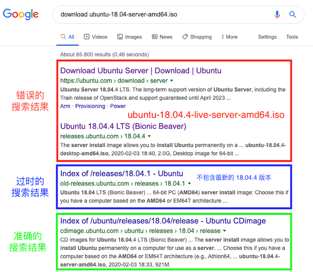
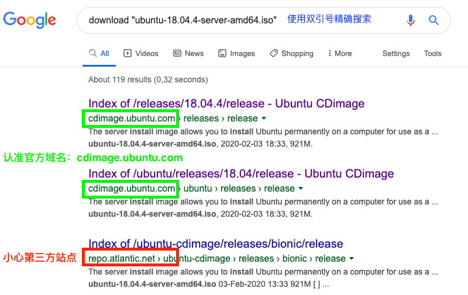
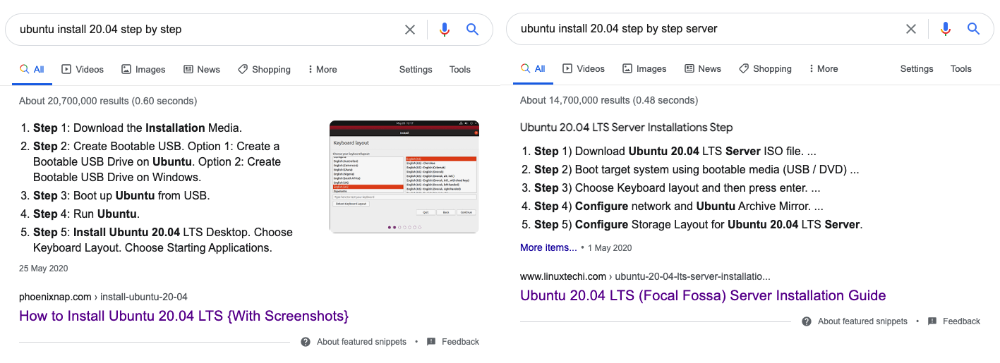

# 操作系统安装与虚拟机配置基础

---

## 课程提纲 {id="sec-1.agenda"}

```
0.   直接导入 .ova 文件
I.   安装镜像获取
II.  虚拟机基本配置
III. 安装过程 FAQ
IV.  安装后 FAQ
```

# 0. 直接导入 .ova 文件

---

链接: https://pan.baidu.com/s/1gjzqIxxF85fctbCHGKhzOA 提取码: pkue 复制这段内容后打开百度网盘手机App，操作更方便哦 


# I. 安装镜像获取

---

## 本节提纲 {id="sec-1.1.agenda"}

1. 安装镜像下载渠道选择
2. 镜像文件版本选择
3. 镜像文件完整性校验

---

## 1. 安装镜像下载渠道选择

* 优先[选择 **官方** 下载](https://ubuntu.com/download)
* 不要贪图下载速度而随意使用 **第三方** 下载镜像：软件包「投毒」和「后门」风险
    * [2008 年的一篇信息安全顶会论文](refs/cappos_mirror_ccs_08.pdf)
    * [2015 年的Xcode非官方版本恶意代码污染事件](https://www.antiy.com/response/xcodeghost.html)

---

## 2. 镜像文件版本选择

**TL;DR**

> ubuntu-18.04.4-server-amd64.iso

或

> ubuntu-<当前官方最新的 LTS 版本号>-server-amd64.iso

```ini
<OS_name>-<version-number>-<type>-<cpu_arch>.iso
```

---

### 安装前 FAQ

首推 [Ubuntu 官方的 FAQ](https://help.ubuntu.com/community/ServerFaq) ，新手关心的服务器版系统安装问题这里都有。

其次还是 [Ubuntu 官方的 FAQ](https://help.ubuntu.com/community/Installation) ，进阶用户关心的诸如双系统共存、U盘安装、升级安装等问题这里都有。

---

### [live-server 版 vs. server 版](https://askubuntu.com/questions/1028580/what-is-the-difference-between-ubuntu-18-04-server-and-ubuntu-18-04-live-server)

* 基于 preseed 实现「无人值守」安装只能选择非 `live-server` 版
* 当前 Ubuntu 18.04 Server 版的官方下载托管域名 [cdimage.ubuntu.com](http://cdimage.ubuntu.com/releases/18.04.4/release/)
* 当前 Ubuntu 18.04 Live-Server 版和 Desktop 版的官方下载托管域名 [releases.ubuntu.com](http://releases.ubuntu.com/18.04/)
* 历史 Ubuntu 版本的官方下载托管域名 [old-releases.ubuntu.com](http://old-releases.ubuntu.com/releases/)

---

### live-server 版专属「无人值守」安装方法

详见 [第一章 实验指南](chap0x01.exp.md)

---

### 使用搜索引擎要仔细



---

### 善用搜索引擎



---

### 32bit vs. 64bit

* 优先选择 `64bit` 操作系统镜像
* [我的电脑是 64bit 系统，为什么无法安装 64bit 虚拟机](https://forums.virtualbox.org/viewtopic.php?f=1&t=62339)

---

### Windows 10 的 Hyper-V 和 Virtualbox 共存

* [Virualbox 6.0.0 开始新增加入对 Windows 宿主机上 Hyper-V 功能的共生支持](https://docs.oracle.com/en/virtualization/virtualbox/6.0/admin/hyperv-support.html) 
* [VirtualBox 6.0 and Hyper-V 共存问题的讨论](https://forums.virtualbox.org/viewtopic.php?f=6&t=90853)

---

### server 版 vs. desktop 版

* 一句话概括：默认安装的软件包数量不同
* 本课程推荐的实验环境是：默认不安装「图形用户界面」的 `server` 版

---

### amd vs. arm

* CPU 指令集类型术语
* 电脑、虚拟机均推荐安装 `amd` 版

---

### 再次认准虚拟镜像文件名

> ubuntu-18.04.4-server-amd64.iso

```ini
<OS_name>-<version-number>-<type>-<cpu_arch>.iso
```

---

## 3. 镜像文件完整性校验

```bash
# mac
shasum -a 256 ubuntu-18.04.4-server-amd64.iso
# e2ecdace33c939527cbc9e8d23576381c493b071107207d2040af72595f8990b

# mac 上使用 SHA256SUMS 文件进行批量自动校验
cat SHA256SUMS
# e2ecdace33c939527cbc9e8d23576381c493b071107207d2040af72595f8990b *ubuntu-18.04.4-server-amd64.iso
# 8eb3c1866ca3b68e4cd22ec9d7c02f97f4d2b3713447370f3c252a4189116824 *ubuntu-18.04.4-server-arm64.iso
# 73b8d860e421000a6e35fdefbb0ec859b9385b0974cf8089f5d70a87de72f6b9 *ubuntu-18.04.4-live-server-amd64.iso

shasum -c SHA256SUMS
# ubuntu-18.04.4-server-amd64.iso: OK
# ubuntu-18.04.4-server-arm64.iso: OK
# ubuntu-18.04.4-live-server-amd64.iso: OK

# linux
sha256sum ubuntu-18.04.4-server-amd64.iso

# windows
certutil -hashfile ubuntu-18.04.4-server-amd64.iso SHA256
# e2 ec da ce 33 c9 39 52 7c bc 9e 8d 23 57 63 81 c4 93 b0 71 10 72 07 d2 04 0a f7 25 95 f8 99 0b
```

# II. 虚拟机基本配置

---

## 本节提纲 {id="sec-2.agenda"}

1. 虚拟机软件选择
2. 网卡配置
3. 加载镜像文件

---

## 1. 虚拟机软件选择

* 开源、免费、全功能 [Virtualbox](https://www.virtualbox.org/wiki/Downloads)

> 不要忘记安装 **VirtualBox Extension Pack**

---

## 2. 网卡配置

* 推荐「双网卡」配置: `NatNetwork` + `HostOnly`

refs:

- [Virtualbox 官网的虚拟网络配置详解文档](https://www.virtualbox.org/manual/ch06.html)
- [Virtualbox 虚拟网络类型差异可视化详解](https://www.nakivo.com/blog/virtualbox-network-setting-guide/)
- [本人的 Virtualbox 虚拟网络详解（2014年课件）](https://github.com/c4pr1c3/cuc-courses/blob/master/2014_2/VirtualboxNetwork.pdf)

# III. 安装过程 FAQ

---

## 本节提纲 {id="sec-3.agenda"}

1. 安装选项
2. 分区方式
    * 存储分区方式选择时，建议安装时勾选「LVM」和不勾选各来一次，得到 2 种分区方式的系统备用
3. 多网卡选择
4. 自动更新

---

## 图文版安装向导

`ubuntu install 20.04 step by step`



# IV. 安装后 FAQ

---

## 本节提纲 {id="sec-4.agenda"}

1. `多重加载` 虚拟硬盘文件配置
2. 使用 `快照` 功能备份和还原虚拟机状态
3. 使用 `描述` 功能备注虚拟机重要配置
4. `net-plan` 配置
5. 网络连通性测试方法


