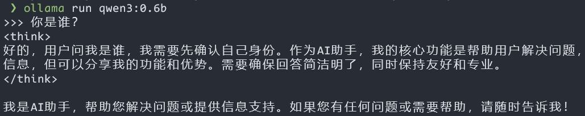
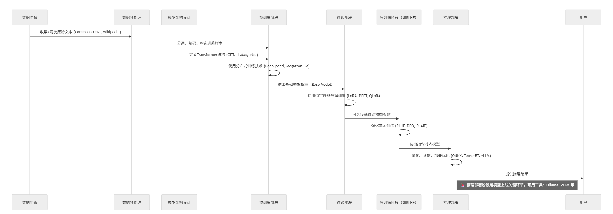
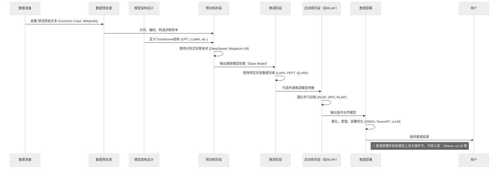
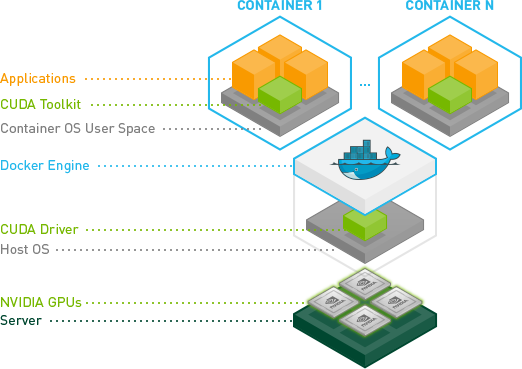
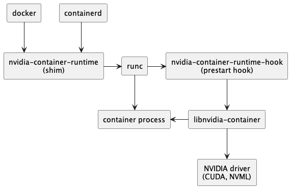
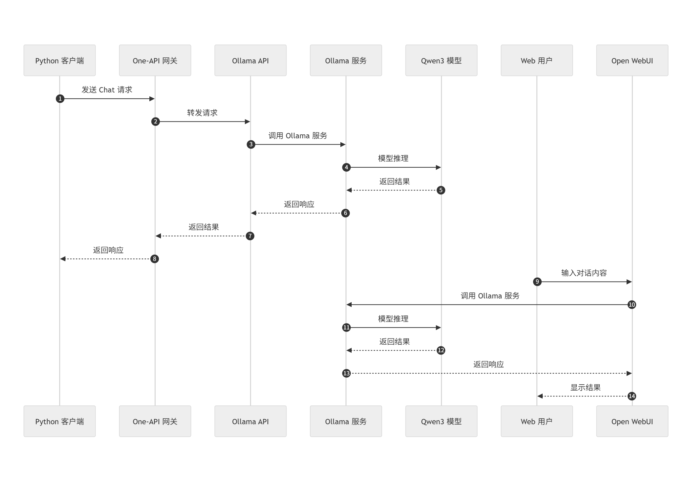
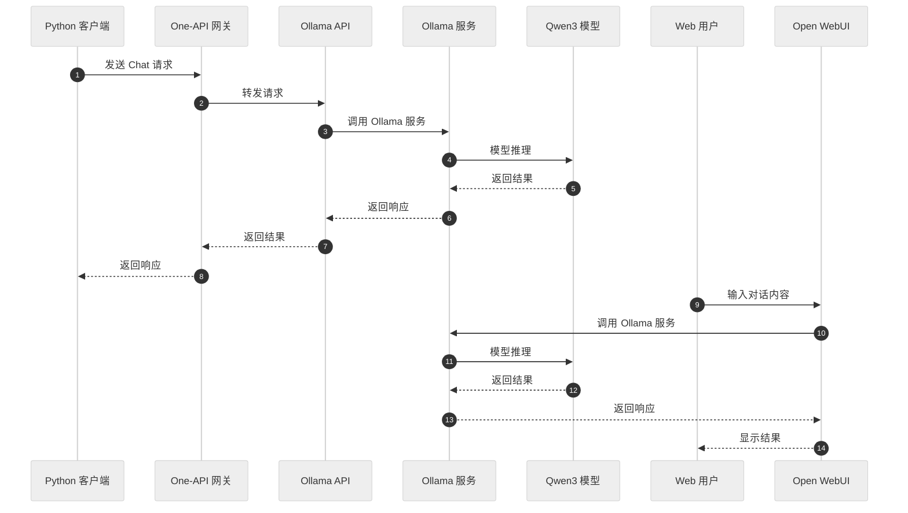

# 第七章 AI 大模型的本地部署与使用 (2025)

---

> Run LLM on your own machine.



# 基础知识准备

---

## 基础知识速通 {id="llm-knowledge-0"}

| 术语                   | 定义                                                                                                           | 层级关系                              | 核心特征                                                                                                           |
| ----------------       | --------------------------------------------------------------------                                           | ------------------------------------- | --------------------------------------------------------------------------------------                             |
| **人工智能 (AI)**      | 使机器能够执行通常需要人类智能的任务（如视觉识别、决策、语言理解等）。                                         | 最外层概念，涵盖所有以下技术          | - 跨领域通用，包含符号AI与统计AI<br>- 包含专家系统、规划、搜索、ML等多种方法                                       |
| **机器学习 (ML)**      | AI 的子集，通过统计算法让计算机从数据中自动学习并改进，而无需显性编程。                                        | 属于 AI，DL 与 LLM 的上层             | - 包括监督、无监督与强化学习<br>- 强调模型的泛化能力、可解释性与数据驱动                                           |
| **深度学习 (DL)**      | ML 的子领域，利用多层（深度）神经网络自动抽取特征与表示，适合大规模、非结构化数据处理。                        | 属于 ML，LLM 的上层                   | - 基于人工神经网络架构（如卷积、循环、Transformer）<br>- 高度依赖计算资源与大规模数据                              |
| **大型语言模型 (LLM)** | 通过深度学习训练的大规模自然语言处理模型，通常基于Transformer架构，具备理解和生成连贯文本的能力。              | 属于 DL                               | - 参数量巨大（数十亿至数千亿）<br>- 支持多种下游NLP任务（翻译、摘要、对话等）                                      |
| **多模态内容生成**     | 指利用深度学习模型同时生成多种模态（如文本、图像、音频、视频等）的内容，实现跨媒体的综合创作。                 | 属于**LLM**及**DL**的生成方向专项应用 | - 支持文本→图像（如 DALL·E）、文本→视频、文本→音频等生成<br>- 依赖自回归或自注意力生成架构，需海量预训练数据与算力 |
| **多模态内容理解**     | 指模型在多种模态数据（如图像、文本、音频、视频）上的联合分析与理解，用于视觉问答、跨模态检索、情感分析等任务。 | 属于**DL**的跨模态融合理解专项应用    | - 通过多分支网络或融合层实现特征对齐与交互<br>- 典型任务包括图像字幕生成、视觉问答、跨模态检索等                   |

---

## 基础知识速通 {id="llm-knowledge-1"}





---

## 基础知识速通 {id="llm-knowledge-1-1"}

| 阶段                | 技术/工具举例                     | 说明                       |
| --------------      | ----------------------------      | -------------              |
| 数据准备            | Common Crawl, Wikipedia           | 来源于开放文本语料         |
| 数据预处理          | SentencePiece, Tokenizers         | 编码、清洗、分词           |
| 模型架构设计        | Transformer, GPT, LLaMA           | 模型结构定义               |
| 训练（预训练）      | DeepSpeed, Megatron-LM, FSDP      | 大规模预训练的分布式技术   |
| 微调                | LoRA, QLoRA, PEFT                 | 针对任务或能力定向优化     |
| 后训练（Alignment） | RLHF, DPO, RLAIF                  | 增加模型的安全性与对齐能力 |
| **推理**            | **Ollama** , vLLM, TensorRT, ONNX | 高效部署与低延迟推理       |

---

## 基础知识速通 {id="llm-knowledge-1-2"}

- Ollama 是一个本地部署和运行大语言模型的工具，它提供了非常简洁的命令行和 API 接口，使用户可以方便地在本地机器上拉取、管理和运行 LLM（如 Qwen、DeepSeek、LLaMA 等），并且支持量化模型（如 GGUF 格式）以降低资源需求。
- vLLM 是一个专注于 **高性能推理** 的开源推理引擎，它的核心价值在于提供 **高吞吐量、低延迟** 的大模型推理服务。

---

## 基础知识速通 {id="llm-knowledge-1-3"}

| 特性               | **vLLM**                           | **Ollama**                  |
| ---------          | ---------------------------------- | -----------------           |
| 所属阶段           | 推理部署                           | 推理部署                    |
| 推理目标           | **高并发、高性能服务端部署**       | 本地推理、轻量部署          |
| 支持模型格式       | HuggingFace Transformers (PyTorch) | GGUF（ggml）、转换过的模型  |
| 主要使用场景       | Web服务/API（如聊天机器人）        | **本地桌面** / 边缘设备推理 |
| 是否支持多用户并发 | ✅ 是，调度优化                    | ❌ 不擅长并发               |
| 是否内置模型管理   | ❌ 无，需外部加载                  | ✅ 支持模型拉取与管理       |
| 安装复杂度         | 中等（需 GPU/环境配置）            | 低（单命令即可运行）        |

---

## 基础知识速通 {id="llm-knowledge-1-4"}

| 对比项        | vLLM                    | GGUF                      |
| ---------     | ----------------------  | ----------------          |
| 依赖框架      | PyTorch / HuggingFace   | ggml / llama.cpp          |
| 模型格式      | `.bin`, `.safetensors`  | `.gguf`                   |
| 推理目标      | 高性能服务端部署（GPU） | 本地轻量化运行（CPU/GPU） |
| 是否支持 GGUF | ❌ 不支持               | ✅ 原生支持               |

---

## AI 大模型本地部署常见解决方案 {id="llm-deploy-1"}

| 方案    | 描述                                                                                                                                            | 具体示例                                                                                                                                                                                                                                                                               |
| ----------       | ----------------------------------------------------------------------------------------                                                        | -------------------------------------------------------------------------------------------------------------------------------------------------------------------------------------------------------------------------------------------------------------------------------------- |
| **裸机部署**     | 直接在本地物理或桌面操作系统（如 Windows 11、Linux、macOS）上安装推理框架与模型，无额外虚拟化或容器层，获得最小化系统开销与最低延迟。           | - **Windows 11 桌面：**<br>  • Cherry Studio（桌面客户端，支持多种 LLM 服务与本地模型）<br>  • Ollama CLI（本地下载与运行模型的命令行工具）<br>- **macOS 桌面：**<br>  • LM Studio（拖拽安装的本地 LLM 桌面应用）<br> - **Linux 服务器：** llama.cpp 或 vLLM 直装运行                  |
| **容器化部署**   | 使用 Docker/Podman 等容器引擎，将推理服务及依赖打包成镜像，通过容器编排（Kubernetes、Docker Compose）实现快速交付、弹性伸缩与环境一致性。       | - `docker run --name ollama -p 11434:11434 ollama/ollama`（Ollama Docker 镜像）<br>- NVIDIA Triton 官方 Docker 镜像（支持 GPU 加速与动态批处理）                                                                                                                                       |


---

## AI 大模型本地部署常见解决方案 {id="llm-deploy-2"}

| 方案    | 描述                                                                                                                                            | 具体示例                                                                                                                                                                                                                                                                               |
| ----------       | ----------------------------------------------------------------------------------------                                                        | -------------------------------------------------------------------------------------------------------------------------------------------------------------------------------------------------------------------------------------------------------------------------------------- |
| **虚拟机部署**   | 在虚拟化平台（如 KVM、VMWare ESXi 等服务器端虚拟化）上运行完整操作系统，再在其内部部署模型服务，提供操作系统级隔离与快照能力，但有一定性能开销。 | - **VMware/KVM：** 部署 NVIDIA Triton Inference Server<br>- **Hyper-V：** 在 Ubuntu VM 内安装 TorchServe 或 ONNX Runtime                                                                                                                                                               |
| **模型服务框架** | 专门的高性能推理服务器或库，提供统一 API（HTTP/gRPC）、动态批处理、监控与多框架支持，可与上述部署方案结合使用以简化推理管理。                   | - NVIDIA Triton Inference Server（TensorFlow/PyTorch/ONNX 多框架支持）<br>- ONNX Runtime（轻量级边缘与云端加速插件）<br>- TorchServe（专为 PyTorch 模型设计，支持多模型管理）                                                                                                          |

> VirtualBox 和 VMWare 等桌面虚拟化产品不支持 GPU 直通，无法在虚拟机中使用 GPU 加速。 

---

## AI 大模型本地部署常见解决方案 {id="llm-deploy-3"}

| 方案    | 描述                                                                                                                                            | 具体示例                                                                                                                                                                                                                                                                               |
| ----------       | ----------------------------------------------------------------------------------------                                                        | -------------------------------------------------------------------------------------------------------------------------------------------------------------------------------------------------------------------------------------------------------------------------------------- |
| **私有云/托管**  | 在企业或客户自有数据中心、私有云环境中部署托管平台，提供全生命周期管理、权限控制与合规支持，兼顾内部安全与集中化运维。                          | - Hugging Face Private Hub（私有化模型仓库与推理平台）                                                                                                                                                                                                                                 |
| **边缘部署**     | 在资源受限或需要低延迟的终端/边缘设备（如树莓派、工业电脑、IoT 设备）上进行推理，通常需要模型量化、硬件加速与专用轻量化框架支持。               | - Raspberry Pi + TensorFlow Lite（量化模型推理）<br>- 量化 LLM on Ollama（在边缘设备上运行 PTQ/WOQ 模型）                                                                                                                                                                              |

---

## 容器化部署的优势

- **环境一致性** 。容器镜像将操作系统、依赖库与模型代码打包，保证开发、测试与生产环境一致，有效避免“Works on My Machine”问题。 
- **弹性伸缩与编排** 。借助 Kubernetes 等编排平台，可自动扩缩容、负载均衡与故障自愈，适合大规模服务。 
- **快速交付与移植性** 。容器镜像可在任意支持容器运行时的主机上启动，极大提升部署效率与跨环境迁移能力。 
- **云原生集成** 。容器天然适配云平台生态（CI/CD、监控、日志等），利于与云端或混合云配合使用。 
- **资源隔离与安全性** 。容器通过命名空间与 cgroups 隔离进程、网络与存储，提供一定的安全性与资源控制。可以在同一台物理机上运行多个不同版本的大模型容器实例，互不干扰。

---

## 容器化 GPU 部署典型组件架构 {id="llm-container-architecture"}

[](https://developer.nvidia.com/blog/nvidia-docker-gpu-server-application-deployment-made-easy/)

---

## 容器化 GPU 部署典型技术调用链 {id="llm-container-call-chain"}

[](https://docs.nvidia.com/datacenter/cloud-native/container-toolkit/latest/arch-overview.html)

---

## 基础知识温故而知新 {id="llm-knowledge-2"}

| 名称             | 主导开发厂商/组织                  | 类型                           | 底层依赖/运行时              | 主要作用                                                                                                    | 与其他技术的关系/替代                                               |
| --------------   | ------                             | -----------------              | ---------------------------  | ----------------------------------------------                                                              | ------------------------------------------------------------------- |
| 容器 (Container) | N/A                                | 概念/标准                      | OCI / Linux 内核             | 通过命名空间（namespaces）和 cgroups 实现 **进程隔离**                                                      | 是以下所有工具和技术的基础                                          |
| runc             | Docker, Inc. / OCI                 | 低级运行时 (OCI)               | Linux kernel                 | 实现 OCI 运行时规范，创建并管理容器进程                                                                     | Docker & Podman 默认运行时                                          |
| containerd       | Docker, Inc. / CNCF                | 守护进程（Daemon）+ 中级运行时 | runc、GRPC API               | 基于 OCI 规范和 runC 构建的守护进程，提供镜像管理、容器生命周期、网络与存储接口等功能，并调用 runC 执行容器 | 对 runC 的封装                                                      |
| LXC              | LinuxContainers.org / Canonical 等 | 低级运行时/工具集              | Linux kernel                 | 提供用户空间 API，创建“系统级”容器                                                                          | runc 的早期替代方案，非 OCI 实现                                    |
| moby             | Docker, Inc.                       | 容器组件集合                   | containerd、runc、libnetwork | Docker 的开源组件集，提供容器运行时、网络、存储等功能                                                       | Docker 的基础组件，Docker Engine 的核心部分                         |

---

## 基础知识温故而知新 {id="llm-knowledge-3"}

| 名称           | 主导开发厂商/组织           | 类型                  | 底层依赖/运行时             | 主要作用                                                                                 | 与其他技术的关系/替代                                               |
| -------------- | ------                      | -----------------     | --------------------------- | ----------------------------------------------                                           | ------------------------------------------------------------------- |
| Docker         | Docker, Inc.                | 容器引擎              | containerd + runc           | 提供构建、运行、分发容器镜像的完整平台                                                   | 依赖 runc；可通过 Docker Desktop 在非 Linux 上运行                  |
| Podman         | Red Hat                     | 容器引擎 (daemonless) | libpod + runc/crun          | 类似 Docker CLI，免守护进程，支持 rootless 容器                                          | Docker 的无守护替代，可与 runc/crun 切换                            |
| Docker Desktop | Docker, Inc.                | 桌面应用/虚拟化层     | HyperKit (macOS)/WSL2 (Win) | 在 macOS/Windows 上运行 Docker Engine + Kubernetes                                       | 封装 Docker ，依赖轻量 VM                                       |
| OrbStack       | OrbStack 公司（独立开发者） | 桌面应用/虚拟化层     | Moby、containerd、runc      | macOS 上的 Docker Desktop 替代，内置开源 Docker Engine（基于 Moby），支持容器与 Linux VM | Docker Desktop 的替代方案                                           |

---

## 基础知识闪回

* OCI: [Open Container Initiative (OCI)](https://opencontainers.org/)
* runc 和 crun 都是容器运行时，可以互换使用，因为二者都实现 OCI 运行时规范。与 runc 相比，crun 容器运行时有一些优点，因为它速度更快，且需要较少的内存。

> crun 是由 Red Hat 主导开发的开源项目，经 2025-05-20 实测在 `Ubuntu 22.04` 和 `Ubuntu 24.04` 上均不能正常工作。

---

### 动手实践时间

- [使用 ansible 初始化安装并配置 Ubuntu 上的 Docker CLI](exp/llm/ansible/)

```bash
# 看看你使用的容器运行时类型和版本信息
docker info | grep -E "(runc|crun)"
# Runtimes: io.containerd.runc.v2 runc
# Default Runtime: runc
# runc version: v1.1.4-0-g5fd4c4d

# 查看 containerd 版本信息
docker info | grep -E "(containerd)"
# Runtimes: io.containerd.runc.v2 runc
# containerd version: 2456e983eb9e37e47538f59ea18f2043c9a73640

# WSL2 Ubuntu 22.04 开启英伟达 GPU 容器支持后
docker info 2>/dev/null | grep -i runtime
# Runtimes: io.containerd.runc.v2 nvidia runc
# Default Runtime: runc
```

# 实践目标

---

## ollama + one-api + open-webui

[](https://mermaid.live/edit#pako:eNrFlN9r01AUx_-VcCH0JR3pmq7tfRiM-uKDOBkiSF7ukrs2kNzU2xu1loJTOkSZOtoHwVmYKBSUVREZm2z-NUnqf-HJrxrb-myezsn53PPje7mnhwzXpAgjWe5ZzBJY6ulMgq8gWtShBSwVGPUEJ3ZBSQOOxbnLtwzh8g7EBfeozvp9WdZZh97zKDPoNYs0OXGSA8QTLvOcXcoTv024sAyrTZiQtrui5bKGbVFwSCf1Jf_0ffDsLPw0XT5xk9Gt7esRC1YxMsPLI3_wbQVp28QhGRw7Enj_AnfuGzkwOD70n58ss7ceUFaOuMQIJif--MUydofu3u5QHoFgSuFoAvOsqNymLEKTFsGJD0KLCSrLS4IE3_fDSVowL15xczNRBkv-q6Nfj_elRosIaTY9C74-SfAkHoGZMFiaXX4G_C8qC85BEAbAL09hiFXqzCE4EIuCU1WCl5Pw9UECxYHiQsqfI__tOPwxDMbHi6kWuoxJf3joX4wWu8wNviJhMjIwea0WE87F_nNVeZnTu4wKZdcFGa6G_uCjPz2fTd_5BwP_9DytmCH_Xb5cr8vyzbsEMp0P6r65Cj9cZBmRghzKHWKZsB3ipaCjeCfoCINp0j3i2UJH8PYBjR75TpcZCEf7QEHc9ZothPeI3QHPa5tEZFth_heewF3XdbIj1LRgpdxI1lG8lWIE4R56iHBVXdO06oZWqa1X1Epdqyioi3CpVFsrq_WqqsG_ilqt9RX0KM6prtVL9VJNXa9qagxsKKjJo2HS6pwyk_KG6zEBedRytf8b66rz0A)



# 基础共性配置

---

## GPU 加速配置  {id="llm-gpu-setup-1"}

- **WSL2 + NVIDIA GPU (CUDA on WSL)**：在 Windows 安装支持 WSL 的 NVIDIA 驱动（下载 [CUDA on WSL 用户指南](https://docs.nvidia.com/cuda/wsl-user-guide/index.html)），启动后在 WSL2 中执行 `nvidia-smi` 验证 GPU。Docker 容器可通过 `--gpus all` 选项使用 GPU ([ Home | Open WebUI](https://docs.openwebui.com/#:~:text=To%20run%20Open%20WebUI%20with,GPU%20support%2C%20use%20this%20command))。有了 CUDA 支持，可显著提升模型推理速度 ([1. NVIDIA GPU Accelerated Computing on WSL 2 — CUDA on WSL 12.8 documentation](https://docs.nvidia.com/cuda/wsl-user-guide/index.html#:~:text=With%20NVIDIA%20CUDA%20support%20for,GPU%20with%20less%20CPU%20intervention))。  
- **Intel GPU (oneAPI)**：如果电脑有 Intel 集成显卡，可使用 Intel oneAPI 提供的工具链加速。安装 [Intel oneAPI Base Toolkit](https://software.intel.com/content/www/us/en/develop/tools/oneapi/base-toolkit.html) 并按 Intel 文档配置 WSL2 GPU 驱动 ([Configure WSL 2 for GPU Workflows](https://www.intel.com/content/www/us/en/docs/oneapi/installation-guide-linux/2023-0/configure-wsl-2-for-gpu-workflows.html#:~:text=To%20be%20able%20to%20use,GPU%20drivers%20as%20described%20below))。完成后，可以在支持 SYCL 的库中利用 Intel GPU 进行计算。  

---

## GPU 加速配置  {id="llm-gpu-setup-2"}

- **AMD GPU** [AMD ROCm](https://rocm.docs.amd.com/en/latest/) | [Ollama now supports AMD graphics cards - 2024-3-14](https://ollama.com/blog/amd-preview)
- **Apple M 系列 GPU (Metal)**：macOS 上若要用 GPU 加速，可使用基于 Metal 的后端。目前 PyTorch 已在 macOS 支持 MPS 后端，只需在代码中指定 `device="mps"`，即可使用 Apple 芯片的 GPU  ([Accelerated PyTorch training on Mac - Metal - Apple Developer](https://developer.apple.com/metal/pytorch/#:~:text=PyTorch%20uses%20the%20new%20Metal,tuned%20kernels%20provided%20by%20MPS))。在 Open WebUI 这种通过 Docker 运行的场景中，GPU 加速较复杂，可先以 CPU 方式运行，或使用支持 MPS 的框架版本（如配置 PyTorch-nightly）。  

# 实践操作 on WSL2

---

- 安装 WSL2
- WSL2 中安装 Ubuntu 22.04
- 安装 Docker Desktop
- 配置显卡驱动
- 安装配置 ollama + open-webui + one-api
- 下载与运行大模型

---

## Ollama 安装与配置  

[https://github.com/c4pr1c3/ollama-docker](https://github.com/c4pr1c3/ollama-docker)

---

### 下载与运行 Qwen 模型  

- **选择合适模型**：根据机器性能选型。入门可选 *轻量级* 模型，如 Qwen2.5 系列的 `0.5B` 或 `1.5B`；高性能机器可尝试更大模型（7B、14B）。
- **运行模型命令**：Ollama 可直接下载并运行模型示例：  

```bash
ollama run qwen2.5:0.5b    # 启动 Qwen2.5-0.5B 指令模型
ollama run qwen2.5:14b     # 启动 Qwen2.5-14B 指令模型
ollama run qwen:0.5b       # 启动 Qwen1.5-0.5B 聊天模型（假设 Ollama 库中已包含）  
```

# 实践操作 on macOS 

---

## 两种安装部署方式

- 容器化方式
    - https://github.com/c4pr1c3/ollama-docker
- 原生安装

---

## 原生安装步骤

```bash
# 1. 安装 Homebrew
/bin/bash -c "$(curl -fsSL https://raw.githubusercontent.com/Homebrew/install/HEAD/install.sh)"

# 2. 安装 Ollama
brew install ollama

# 3. 设置国内下载镜像源
export HF_ENDPOINT=https://hf-mirror.com
```

# 课后实验任务

---

## 任务描述

> 以下任务请根据自己电脑的操作系统和硬件环境选择合适的方式完成。

- **网页问答** 。使用 Ollama + Open WebUI + One-API 配置不少于 3 种大模型（如 `Qwen2.5`、`Qwen3`、`DeepSeek` 等），并能通过 WebUI 进行交互式问答。
- **AI 编程** 。采用 `BYOK` 模式配置 AI 编程工具，并在该环境中以本课程 [第四章试验任务](chap0x04.exp.md) 为例，证明该环境可以实现 AI 编程任务。
    - `BYOK`: **Bring Your Own Key** ，指用户使用自己的或第三方服务提供商提供的密钥或模型。
    - 推荐使用 [Continue.dev](https://www.continue.dev/) 作为基础 AI 编程工具。

---

### 网页问答实验任务

> 以下问答问题也可以自行根据测试类别，更换不同的测试用问题进行测试。

- **幻觉识别** ：“strawberry” 这个单词中有几个字母 “r”？
- **生活常识** ：蓝牙耳机坏了，我应该去医院挂哪个科？
- **逻辑推理** ：如果今天是星期五，那么 100 天之后是星期几？
- **地理知识** ：巴黎是德国的首都吗？
- **逆向理解** ：有一个人对你说：“我在说谎。”这句话是真的还是假的？

---

## 本地环境适配说明

- 没有本地独立显卡
    - 可以使用公有云服务提供商或大模型服务商提供的 `LLMaaS`（`LLM as a Service`） 解决方案，如 `阿里云`、`硅基流动`、`火山引擎` 等，通过 API 调用大模型进行推理。
    - One-API 网关配置封装上游大模型服务商的 API 接口，提供统一的接口供 Open WebUI 和本地 AI 编程任务的 API 调用。
- 有本地独立显卡
    - 使用本地 GPU 加速的方式运行大模型。
    - One-API 网关可以通过 Ollama API 调用本地模型，提供统一的接口。

---

## 任务结果分析与说明 {id="llm-task-analysis-1"}

> 针对以下实验观测和分析需求，撰写实验报告，图文并茂说明实验结果和相关分析过程。

- 共性要求
    - 大模型在完成 **网页问答** 任务时的推理性能（如每秒处理的 Token 数量）、推理延迟（如平均响应时间）和模型输出的准确率等。
    - 大模型在完成 **AI 编程** 任务时的代码一次性完成率情况、代码质量情况和代码运行情况等。
    - 可以定性和定量手段相结合、主观评价和客观评测相结合。不限制评价指标和评价方法，可以自行设计评价指标和评价方法。

---

## 任务结果分析与说明 {id="llm-task-analysis-2"}

> 针对以下实验观测和分析需求，撰写实验报告，图文并茂说明实验结果和相关分析过程。

- 没有本地独立显卡
    - 分析不同 AI 模型完成不同任务时的 `Token` 消耗情况，比较不同模型的性能和成本。
- 有本地独立显卡
    - 分析不同 AI 模型完成不同任务时的 GPU、内存和 CPU 性能变化曲线，比较不同模型的性能和算力成本。

---

## 参考资料

- [Ollama is now available as an official Docker image - 2023-10-5](https://ollama.com/blog/ollama-is-now-available-as-an-official-docker-image)
- Ollama 与 Qwen 文档 [qwen.readthedocs.io](https://qwen.readthedocs.io/zh-cn/latest/_sources/run_locally/ollama.md.txt#:~:text=device,%60ollama%20run%20qwen2.5%3A72b) | [qwen](https://ollama.com/library/qwen#:~:text=from%200)
- Open WebUI 官方文档 [ Home | Open WebUI](https://docs.openwebui.com/#:~:text=Open%20WebUI%20is%20an%20extensible%2C,a%20powerful%20AI%20deployment%20solution) | [ Home | Open WebUI](https://docs.openwebui.com/#:~:text=To%20run%20Open%20WebUI%20with,GPU%20support%2C%20use%20this%20command)
- Docker & WSL2 指南 [Install Docker in WSL2 with Ubuntu 22.04 LTS](https://crapts.org/2022/05/15/install-docker-in-wsl2-with-ubuntu-22-04-lts#:~:text=The%20reason%20this%20errors%20occurs,that%20Docker%20will%20work%20again) | [Mac | Docker Docs
](https://docs.docker.com/desktop/setup/install/mac-install/#:~:text=1,or%20from%20the%20release%20notes)
- 国内网络加速实践 [ollama+open-webui，本地部署自己的大模型_ollama webui-CSDN博客](https://blog.csdn.net/spiderwower/article/details/138463635#:~:text=conda%20config%20,url%20https%3A%2F%2Fpypi.tuna.tsinghua.edu.cn%2Fsimple) | [ollama+open-webui，本地部署自己的大模型_ollama webui-CSDN博客](https://blog.csdn.net/spiderwower/article/details/138463635#:~:text=%E8%AE%BE%E7%BD%AEnpm%E4%B8%8B%E8%BD%BD%E9%95%9C%E5%83%8F%E6%BA%90%EF%BC%8C%E6%8F%90%E9%AB%98%E4%B8%8B%E8%BD%BD%E9%80%9F%E5%BA%A6)
- GPU 加速文档 [1. NVIDIA GPU Accelerated Computing on WSL 2 — CUDA on WSL 12.8 documentation](https://docs.nvidia.com/cuda/wsl-user-guide/index.html#:~:text=With%20NVIDIA%20CUDA%20support%20for,GPU%20with%20less%20CPU%20intervention) | [Accelerated PyTorch training on Mac - Metal - Apple Developer](https://developer.apple.com/metal/pytorch/#:~:text=PyTorch%20uses%20the%20new%20Metal,tuned%20kernels%20provided%20by%20MPS)
